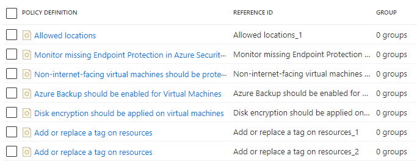

# Create and manage policies

## Assign a policy
Go to the Azure portal to assign policies. Search for and select Policy.


Select Assignments on the left side of the Azure Policy page. An assignment is a policy that has been assigned to take place within a specific scope.


Select Assign Policy from the top of the Policy - Assignments page.


On the Assign Policy page and Basics tab, select the Scope by selecting the ellipsis and selecting either a management group or subscription. Optionally, select a resource group. A scope determines what resources or grouping of resources the policy assignment gets enforced on. Then select Select at the bottom of the Scope page.

Resources can be excluded based on the Scope. Exclusions start at one level lower than the level of the Scope. Exclusions are optional, so leave it blank for now.

Select the Policy definition ellipsis to open the list of available definitions. You can filter the policy definition Type to Built-in to view all and read their descriptions.

Select Inherit a tag from the resource group if missing. If you can't find it right away, type inherit a tag into the search box and then press ENTER or select out of the search box. Select Select at the bottom of the Available Definitions page once you have found and selected the policy definition.


The Assignment name is automatically populated with the policy name you selected, but you can change it. For this example, leave Inherit a tag from the resource group if missing. You can also add an optional Description. The description provides details about this policy assignment.

Leave Policy enforcement as Enabled. When Disabled, this setting allows testing the outcome of the policy without triggering the effect,

Assigned by is automatically filled based on who is logged in. This field is optional, so custom values can be entered.

Select the Parameters tab at the top of the wizard.

For Tag Name, enter Environment.

Select the Remediation tab at the top of the wizard.

Leave Create a remediation task unchecked. This box allows you to create a task to alter existing resources in addition to new or updated resources.

Create a Managed Identity is automatically checked since this policy definition uses the modify effect. Permissions is set to Contributor automatically based on the policy definition.

Select the Non-compliance messages tab at the top of the wizard.

Set the Non-compliance message to This resource doesn't have the required tag. This custom message is displayed when a resource is denied or for non-compliant resources during regular evaluation.

Select the Review + create tab at the top of the wizard.

Review your selections, then select Create at the bottom of the page.


## Implement a new custom policy
Select Definitions under Authoring in the left side of the Azure Policy page.


Select + Policy definition at the top of the page. This button opens to the Policy definition page.

Enter the following information:

- The management group or subscription in which the policy definition is saved. Select by using the ellipsis on Definition location.
- The name of the policy definition - Require VM SKUs not in the G series
- The description of what the policy definition is intended to do - This policy definition enforces that all virtual machines created in this scope have SKUs other than the G series to reduce cost.
- Choose from existing options (such as Compute), or create a new category for this policy definition.
- Copy the following JSON code and then update it for your needs with:
  - The policy parameters.
  - The policy rules/conditions, in this case - VM SKU size equal to G series
  - The policy effect, in this case - Deny.
Here's what the JSON should look like. Paste your revised code into the Azure portal.

```json
{
    "policyRule": {
        "if": {
            "allOf": [{
                    "field": "type",
                    "equals": "Microsoft.Compute/virtualMachines"
                },
                {
                    "field": "Microsoft.Compute/virtualMachines/sku.name",
                    "like": "Standard_G*"
                }
            ]
        },
        "then": {
            "effect": "deny"
        }
    }
}
```
*for more examples : <https://learn.microsoft.com/en-us/azure/governance/policy/samples/>*

Select Save.

## Create and assign an initiative definition
With an initiative definition, you can group several policy definitions to achieve one overarching goal. An initiative evaluates resources within scope of the assignment for compliance to the included policies.

## Create an initiative definition
Select Definitions under Authoring in the left side of the Azure Policy page.


Select + Initiative Definition at the top of the page to open the Initiative definition wizard.


Use the Initiative location ellipsis to select a management group or subscription to store the definition. If the previous page was scoped to a single management group or subscription, Initiative location is automatically populated.

Enter the Name and Description of the initiative.
This example validates that resources are in compliance with policy definitions about getting secure. Name the initiative Get Secure and set the description as: This initiative has been created to handle all policy definitions associated with securing resources.

For Category, choose from existing options or create a new category.

Set a Version for the initiative, such as 1.0.

Select Next at the bottom of the page or the Policies tab at the top of the wizard.

Select Add policy definition(s) button and browse through the list. Select the policy definition(s) you want added to this initiative. For the Get Secure initiative, add the following built-in policy definitions by selecting the checkbox next to the policy definition:
- Allowed locations
- Endpoint protection should be installed on machines
- Non-internet-facing virtual machines should be protected with network security groups
- Azure Backup should be enabled for Virtual Machines
- Disk encryption should be applied on virtual machines
- Add or replace a tag on resources (add this policy definition twice)

After selecting each policy definition from the list, select Add at the bottom of the list. Since it's added twice, the Add or replace a tag on resources policy definitions each get a different reference ID.



Select Next at the bottom of the page or the Groups tab at the top of the wizard. New groups can be added from this tab. For this tutorial, we aren't adding any groups.

Select Next at the bottom of the page or the Initiative parameters tab at the top of the wizard. If we wanted a parameter to exist at the initiative for passing to one or more included policy definitions, the parameter is defined here and then used on the Policy parameters tab. For this tutorial, we aren't adding any initiative parameters.

Select Next at the bottom of the page or the Policy parameters tab at the top of the wizard.

Policy definitions added to the initiative that have parameters are displayed in a grid. The value type can be 'Default value', 'Set value', or 'Use Initiative Parameter'. If 'Set value' is selected, the related value is entered under Value(s). If the parameter on the policy definition has a list of allowed values, the entry box is a dropdown list selector. If 'Use Initiative Parameter' is selected, a dropdown list select is provided with the names of initiative parameters created on the Initiative parameters tab.


Set the 'Allowed locations' value type to 'Set value' and select 'West Europe' from the dropdown list. For the two instances of the Add or replace a tag on resources policy definitions, set the Tag Name parameters to 'Env' and 'CostCenter and the Tag Value parameters to 'Test' and 'Lab' as shown below. Leave the others as 'Default value'. Using the same definition twice in the initiative but with different parameters, this configuration adds or replaces an 'Env' tag with the value 'Test' and a 'CostCenter' tag with the value of 'Lab' on resources in scope of the assignment.


Select Review + create at the bottom of the page or at the top of the wizard.

Review the settings and select Create.

## Assign an initiative definition
Select Definitions under Authoring in the left side of the Azure Policy page.

Locate the Get Secure initiative definition you previously created and select it. Select Assign at the top of the page to open to the Get Secure: Assign initiative page.


Fill out the Get Secure: Assign Initiative page by entering the following example information. You can use your own information.

- Scope: The management group or subscription you saved the initiative to becomes the default. You can change scope to assign the initiative to a subscription or resource group within the save location.
- Exclusions: Configure any resources within the scope to prevent the initiative assignment from being applied to them.
- Initiative definition and Assignment name: Get Secure (pre-populated as name of initiative being assigned).
- Description: This initiative assignment is tailored to enforce this group of policy definitions.
- Policy enforcement: Leave as the default Enabled.
- Assigned by: Automatically filled based on who is logged in. This field is optional, so custom values can be entered.

Select the Parameters tab at the top of the wizard. If you configured an initiative parameter in previous steps, set a value here.

Select the Remediation tab at the top of the wizard. Leave Create a Managed Identity unchecked. This box must be checked when the policy or initiative being assigned includes a policy with the deployIfNotExists or modify effects. As the policy used for this tutorial doesn't, leave it blank.

Select the Review + create tab at the top of the wizard.

Review your selections, then select Create at the bottom of the page.
