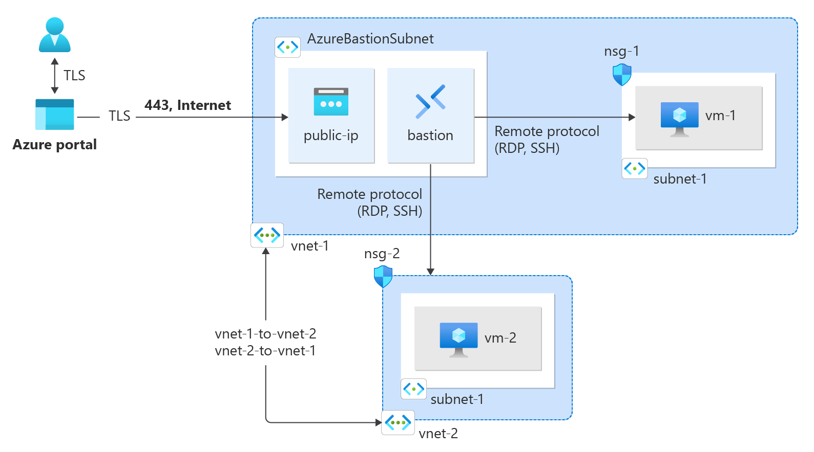
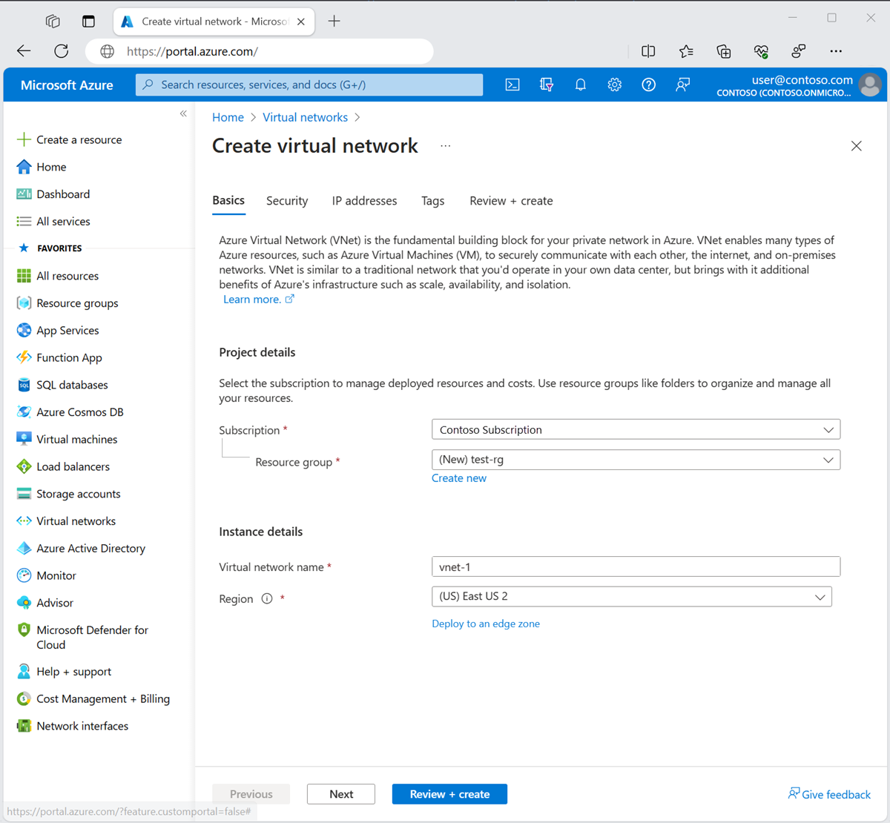
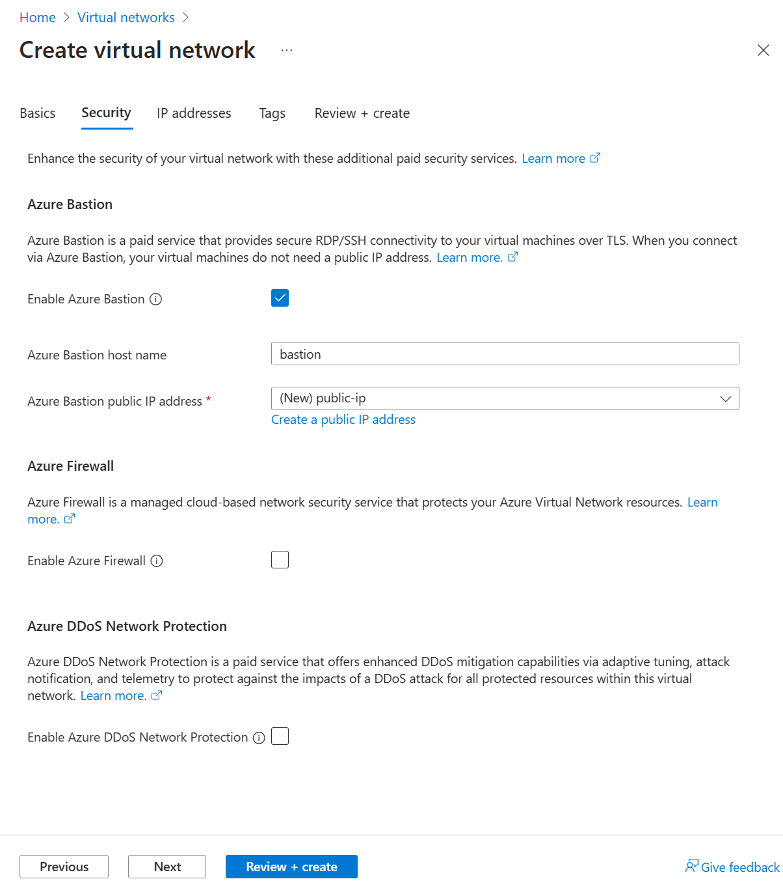
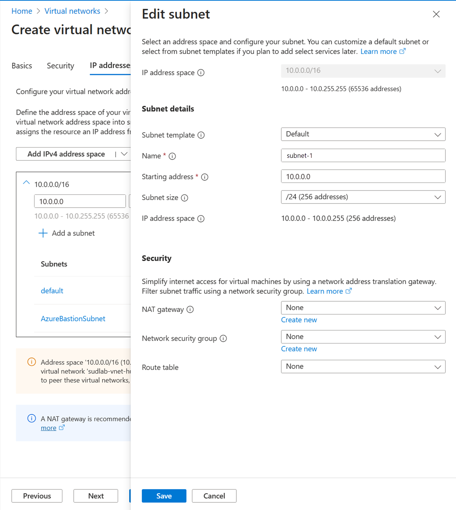
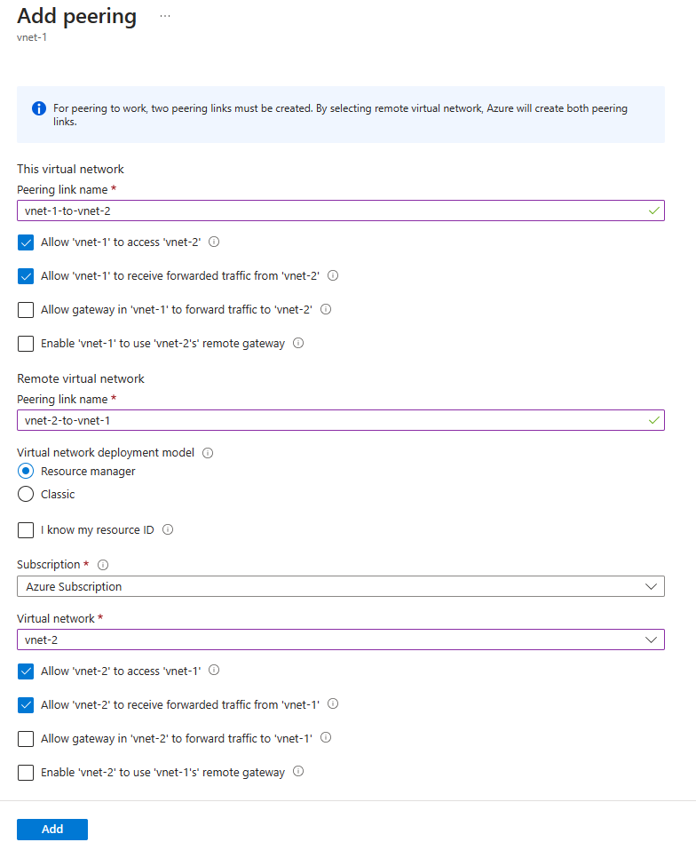

# Connect virtual networks with virtual network peering

## Goal of the workshop 


## Create a virtual network and bastion host
The following procedure creates a virtual network with a resource subnet, an Azure Bastion subnet, and an Azure Bastion host.

1. In the portal, search for and select Virtual networks.
2. On the Virtual networks page, select + Create.
3. On the Basics tab of Create virtual network, enter or select the following information:
    - Subscription Select your subscription.
    - Resource group Select Create new.
    - Enter test-rg in Name.
    - Select OK.
    - Name Enter vnet-1.
    - Region Select the region to create the virtual network in.

4. Select Next to proceed to the Security tab.
5. Select Enable Bastion in the Azure Bastion section of the Security tab.
6. Enter or select the following information in Azure Bastion:
    - Azure Bastion host name Enter bastion.
    - Azure Bastion public IP address Select Create a public IP address.
    - Enter public-ip in Name.
    - Select OK.

7. Select Next to proceed to the IP Addresses tab.
8. In the address space box in Subnets, select the default subnet.
9. In Edit subnet, enter or select the following information:
    - Subnet template Leave the default Default.
    - Name Enter subnet-1.
    - Starting address Leave the default of 10.0.0.0.
    - Subnet size Leave the default of /24(256 addresses).



10. Select Save.
11. Select Review + create at the bottom of the screen, and when validation passes, select Create.
12. Repeat the previous steps to create a second virtual network with the following values:
    - Name vnet-2
    - Address space 10.1.0.0/16
    - Resource group test-rg
    - Subnet name subnet-1
    - Subnet address range 10.1.0.0/24
```
The second virtual network can be in the same region as the first virtual network or in a different region. You can skip the Security tab and the Bastion deployment for the second virtual network. After the network peer, you can connect to both virtual machines with the same Bastion deployment.
```

## Create virtual network peer
Use the following steps to create a two way network peer between vnet1 and vnet2.
1. In the search box at the top of the portal, enter Virtual network. Select Virtual networks in the search results.
2. Select vnet-1.
3. In Settings select Peerings.
3. Select + Add.
4. Enter or select the following information in Add peering:
    - Peering link name Enter vnet-1-to-vnet-2.
    - Allow 'vnet-1' to access 'vnet-2' Leave the default of selected.
    - Allow 'vnet-1' to receive forwarded traffic from 'vnet-2' Select the checkbox.
    - Allow gateway in 'vnet-1' to forward traffic to 'vnet-2' Leave the default of cleared.
    - Enable 'vnet-1' to use 'vnet-2' remote gateway Leave the default of cleared.
    - Peering link name Enter vnet-2-to-vnet-1.
    - Virtual network deployment model Leave the default of Resource Manager.
    - Subscription Select your subscription.
    - Virtual network Select vnet-2.
    - Allow 'vnet-2' to access 'vnet-1' Leave the default of selected.
    - Allow 'vnet-2' to receive forwarded traffic from 'vnet-1' Select the checkbox.
    - Allow gateway in 'vnet-2' to forward traffic to 'vnet-1' Leave the default of cleared.
    - Enable 'vnet-2' to use 'vnet-1's' remote gateway Leave the default of cleared.


5. Select Add.

## Create virtual machines
Create a virtual machine in each virtual network to test the communication between them.

### Create test virtual machine
The following procedure creates a test virtual machine (VM) named vm-1 in the virtual network.
1. In the portal, search for and select Virtual machines.
2. In Virtual machines, select + Create, then Azure virtual machine.
3. On the Basics tab of Create a virtual machine, enter or select the following information:
    - Subscription Select your subscription.
    - Resource group Select test-rg.
    - Virtual machine name Enter vm-1.
    - Region Select the region to create the virtual machine in.
    - Availability options Select No infrastructure redundancy required.
    - Security type Leave the default of Standard.
    - Image Select Ubuntu Server 22.04 LTS - x64 Gen2.
    - VM architecture Leave the default of x64.
    - Size Select a size.
    - Authentication type Select Password.
    -Username Enter azureuser.
    - Password Enter a password.
    - Inbound port rules 
    - Public inbound ports Select None.
4. Select the Networking tab at the top of the page.
5. Enter or select the following information in the Networking tab:
    - Virtual network Select vnet-1.
    - Subnet Select subnet-1 (10.0.0.0/24).
    - Public IP Select None.
    - NIC network security group Select Advanced.
    - Configure network security group Select Create new.
    - Enter nsg-1 for the name.
6. Leave the rest at the defaults and select OK.
7. Leave the rest of the settings at the defaults and select Review + create.
8. Review the settings and select Create.
9. Repeat the previous steps to create a second virtual machine in the second virtual network with the following values:
    - Virtual machine name vm-2
    - Region Select the region to create the virtual machine in.
    - Virtual network Select vnet-2.
    - Subnet Select subnet-1 (10.1.0.0/24).
    - Public IP None
    - Network security group name nsg-2

## Connect to a virtual machine
Use ping to test the communication between the virtual machines.
1. In the portal, search for and select Virtual machines.
2. On the Virtual machines page, select vm-1.
3. In the Overview of vm-1, select Connect.
4. In the Connect to virtual machine page, select the Bastion tab.
5. Select Use Bastion.
6. Enter the username and password you created when you created the VM, and then select Connect.

## Communicate between VMs
1. At the bash prompt for vm-1, enter `ping -c 4 vm-2.`
You get a reply similar to the following message:
```
azureuser@vm-1:~$ ping -c 4 vm-2
PING vm-2.3bnkevn3313ujpr5l1kqop4n4d.cx.internal.cloudapp.net (10.1.0.4) 56(84) bytes of data.
64 bytes from vm-2.internal.cloudapp.net (10.1.0.4): icmp_seq=1 ttl=64 time=1.83 ms
64 bytes from vm-2.internal.cloudapp.net (10.1.0.4): icmp_seq=2 ttl=64 time=0.987 ms
64 bytes from vm-2.internal.cloudapp.net (10.1.0.4): icmp_seq=3 ttl=64 time=0.864 ms
64 bytes from vm-2.internal.cloudapp.net (10.1.0.4): icmp_seq=4 ttl=64 time=0.890 ms
```
2. Close the Bastion connection to vm-1.
3. Repeat the steps in Connect to a virtual machine to connect to vm-2.
4. At the bash prompt for vm-2, enter `ping -c 4 vm-1`.
You get a reply similar to the following message:
```
azureuser@vm-2:~$ ping -c 4 vm-1
PING vm-1.3bnkevn3313ujpr5l1kqop4n4d.cx.internal.cloudapp.net (10.0.0.4) 56(84) bytes of data.
64 bytes from vm-1.internal.cloudapp.net (10.0.0.4): icmp_seq=1 ttl=64 time=0.695 ms
64 bytes from vm-1.internal.cloudapp.net (10.0.0.4): icmp_seq=2 ttl=64 time=0.896 ms
64 bytes from vm-1.internal.cloudapp.net (10.0.0.4): icmp_seq=3 ttl=64 time=3.43 ms
64 bytes from vm-1.internal.cloudapp.net (10.0.0.4): icmp_seq=4 ttl=64 time=0.780 ms
Close the Bastion connection to vm-2.
```
5. Close the Bastion connection to vm-2.s