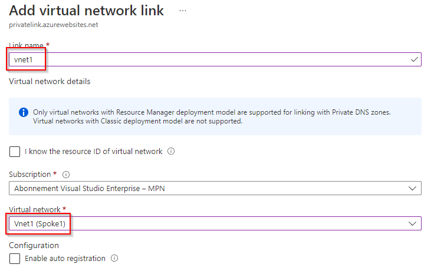
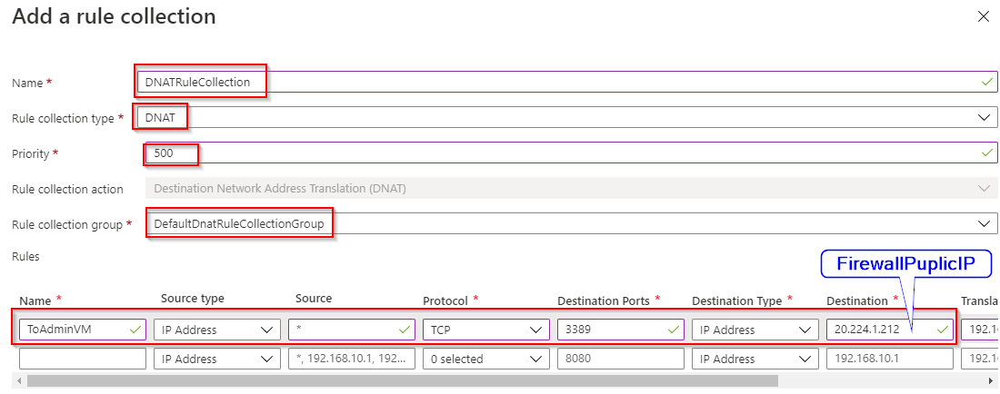

# Create a virtual network

## Goal of the Workshop


## Vnet Hub
This VNET will be set up in Hub ressource group and will be named Hub.


We define the address range for the Vnet and add a /26 subnet for the firewall with a name imposed by Azure “AzureFirewallSubnet”


```
Azure firewall requires at least /26 for the subnet
```
Click on Next and validate:


## Vnet Spoke 1 and Vnet spoke 2
Let's carry out the same operation for Spoke 1 & 2 with the following information:


After deploying the 3 Vnets, we can configure VNET peering.

## Setting up Vnet peering
Peering will allow the three Vnets to be interconnected. To do this, we start with the Vnet “Hub”
```
Vnet Peering is not transitive by default. It does not allow Spoke 1 and Spoke 2 to communicate automatically. The firewall allows this by taking the role of router. 
The VPN Gateway can also fulfill this role.
```
Go to the Vnet “Hub” control panel and click on “peering”:


### Peering between Hub and Spoke 1 in both directions
Click Add.

Name the peering “HubToSpoke1” and select “Vnet1”.

We select “Allow”: “Traffic to remote virtual network”

We select: Block traffic that from outside this virtual network”
(Traffic not coming from vnet1)

For “virtual network gateway or route server”, we leave the “none” option because the role of router in our scenario will be taken care of by the firewall.


Click Add.

Name the peering “Spoke1To Hub”.

Select “Vnet1”.

Allow: “Traffic to remote virtual Network”

Allow: “Traffic forwarded from remote virtual Network”

For “virtual network gateway or route server”, we leave the “none” option because the router role in our scenario will be taken care of by the firewall.


### Peering between Hub and Spoke 2 in both directions

Click Add.

Name the peering “HubToSpoke2”.

We select “Allow”: “Traffic to remote virtual network”

We select: “Block traffic that from outside this virtual network”
(Traffic not coming from Vnet 2)

For “virtual network gateway or route server”, we leave the “none” option because the router role in our scenario will be taken care of by the firewall.


Click Add again and name the peering “Spoke2ToHub”

Select “Vnet2.”

Allow: “Traffic to remote virtual Network”

Allow: “Traffic forwarded from remote virtual Network”

For “virtual network gateway or route server”, we leave the “none” option because the router role in our scenario will be taken care of by the firewall.


We have now completed the peering configuration between the Hub Vnet and those of Spoke 1 and Spoke 2. We can now deploy the security element of our architecture: the firewall.

## Azure firewall deployment
Azure firewall will secure North/South flows (external flows to private network) and East/West flows (inter Vnet flows). As a prerequisite, the installation needs a Vnet (hub) and a subnet called AzureFirewallSubnet.

### Creating Azure Firewall
Go to “Create a resource”, type “Azure firewall” and click “Create”.


Complete the fields below:
- Resource Group: Hub
- Name: FirewallDemo
- Region: Western Europe
- Firewall tier: Standard


In the “Firewall policy” field, click on “Add New”:
- Policy Name: Parent Policy
- Region: Western Europe
- Policy Tier: Standard

And click “OK”:


We will create a public IP for the firewall, this step being a prerequisite for deployment.
- Name: FWPIP
- SKU: standard
- Assignment: Static

Click “OK”.


## Deploying Virtual Machines
We are deploying two virtual machines: VMadmin as an admin machine in Vnet1 and VM2 in Vnet 2. All machines will run under Windows Server 2022.

### VmAdmin


#### Networking
- Virtual network: VNET1
- Subnet: 192.168.16.0/24
- To use RDP we need to open port 3389 in the NSG.


### Vm2
- Resource Group : Spoke2
- Region : West Europe


#### Networking
- Virtual network: VNET2
- Subnet: 192.168.32.0/24
- To use RDP we need to open port 3389 in the NSG.


We deployed the virtual machines on the private network but they are not accessible and cannot communicate with each other. We need to route network flows using the UDR (User Define Route) service.

## UDR (User Define Route)
UDR is an essential network service for controlling network flows. It allows us to redirect all flows to the firewall.

### Creation of the User Define Route
Go to Create => Network => Route Table


Provide the following information:
- Resource Group: Hub
- Region: Western Europe
- Name: DefaultRT


#### UDR association with Subnet

After creating the UDR, we will associate our default UDR with the subnets where the virtual machines are located, so that the UDR routes the flows coming from the machines.

For that :

- Click on “Subnet” and “Association”
- Select the two subnets created previously
- After these actions, you should have both subnets listed (AdminSubnet and VM subnet)


For configuration, click on “route” then “Add”.


Set your route name in the “Route Name” field (ToFirewall)

Address prefix: 0.0.0.0/0

Next Hop: Virtual Appliance

Next Hop address: 192.168.0.4 (private IP address of the Firewall)

Click “Add”.


We have just configured the UDR so that IPs belonging to the address range 0.0.0.0/0 are redirected to the private IP address of the Virtual Appliance (Firewall).
Now, we attack the Azure Private DNS service which will be used by our web with its private end point.

## Azure Private DNS
This step involves deploying the Azure Private DNS and attaching it to each Vnet so that the domain name is known by the virtual machines (VMs).

### Creating Azure Private DNS
- Click on “Create a resource”
- Type “Private DNS Zone”
- Click “Create”


- In the “resource group” field: Hub
- Name: privatelink.azurewebsite.net
```
Warning: default domain name for webapp resources.
(https://learn.microsoft.com/en-us/azure/private-link/private-endpoint-dns#azure-services-dns-zone-configuration)
```

Click on “review+create”


### Azure private DNS Vnet association
Click on “Virtual Network Links”

Then on “Add”


Type the name of one of the three Vnets created in the VNET chapter:



Repeat this action for the other Vnets (hub & Vnet2).

At the end, we will have the list of all Vnets:


## Installing the Web App service
The Web App service (webbAppSpoke2) is the last item to install. It will be in Spoke 2 and should only be accessible from a Private ndpoint.

## Creation of the Web App
Let's start by creating a new resource: click on “Create Resource” and “Web App”:


Complete the fields below:
- Resource group: Spoke2
- NameWebApp: Spoke2
- Publish: Config By Default
- stack runtime: .NET 6
- Region: Western Europe
- Operating System: Window/Linux (at your convenience)
Next, click “Review and Create”.


And on “Create”:


Après le déploiement, on peut utiliser l’URL public de la WebApp <https://webappspoke2.azurewebsites.net> pour avoir l’image ci-dessous.


However, we want the WebApp not to be open on the Internet. The WebApp's network settings must change to only work with a private endpoint in our network.

## Private Endpoint
Click on “Networking” and “Private Endpoint” to create an access point to our WebApp.


Click on “Add”:


- Name : webappPE
- Virtual Network : VNET2
- Subnet : PrivateEndpointSubnet
And validate the Private endpoint.


After this operation, the WebApp should no longer be accessible via the Internet. If we use the URL to access it, this is what is displayed:


Our WebApp is now accessible only from the private network, but to finish the configuration we must link our WebApp with our private DNS zone.

## DNS registration


We have completed the installation of our Hub and Spoke infrastructure. Pay special attention to Vnet, peering, UDR steps for successful installation. We can now begin scenario 1.

## Scenario 1: access VMadmin via rdp via the firewall’s public IP
The objective of this first scenario is to allow access to VMadmin via RDP via the public IP of the Firewall.

To do this, we will configure the DNAT of the firewall and test a remote connection with the public IP address of the firewall to connect.

### Firewall Policy


### Firewall configuration

Go to the Firewall Policy (Azure resource which carries the firewall rules).

Click on “DNAT Rule” and “Add a rule Collection”:


We want any IP to be able to connect via RDP to the VMadmin machine from the outside using only the public IP of the firewall. The latter must be able to redirect the flow directly to the private IP of the VMadmin.

To do this, we will follow the following configuration:

**Rule Collection :**

- Name : DNATRuleCollection
- Rule collection Type : Dnat
- Priority : 500
- Rule Collection Group: DefaultDnatRuleCollectionGroup

**Rule :**
- Name : To VmAdminVM
- SourceType : ip Adress
- Source : *
- Protocole : TCP
- Destination port : 3389 (Port RDP)
- Destination Type: IP address
- Destination : (IP publique du firewall)
- Translated adress : IP privée de VMadmin



Validate the configuration and let the new DNAT configuration deploy.

### Test Connexion
After deploying the rule, we will connect to VMadmin from the IP address of the firewall.

With mstsc.exe from your workstation executable and fill in:
- Computer: give the public IP of the firewall
- User name: AdminVm (admin local account)
- Connection


Type the password for the local admin account of the VM admin

The remote Desktop console indicates the IP address of the Firewall. However, if you check the network configuration of the machine (ipconfig /all), you can see the private address of the machine.


## Scenario 2: connection to VM2 from VMadmin in RDP
In this second scenario, it is a question of connecting to VM2 from VMadmin in RDP. Of course, the flow must be filtered by the Firewall.

### Network Configuration
Go to “resource Firewal Policy”=> “Network rules” then click on “Add rule collection”:


Configure the rule collection as shown below:
- Name: NetworkRuleCollection
- Rule Collection Type: Network
- Priority: 500
- Rule Collection action: Allow
- Rule Collection Group: DefaultNetworkRuleCollectionGroup

### Rules
Rule:
- Name: VmAdminToVm2
- SourceType: IP Address
- Source: Private IP of the VM Admin (192.16.16.4)
- Protocol: Any
- Destination port: 3389 (RDP port)
- Destination Type: IP address
- Destination: VM2 private IP


Validate the configuration and let the new Network configuration deploy.

To verify that AdminVM and VM2 are communicating, we can use Network watcher with Next Hop.
We give :
- Virtual Machine: AdminVM
- Network interface: choose the AdminVM network card from the drop-down list
- Source IP Address: IP address of AdminVM 
- Destination: IP address of VM 2

Click on “Next Hop” and here is the result:
- Next Hop type: VirtualAppliance
- IPaddress: Private ip address of the firewall

This result confirms that the “peering” and the “route table” work by redirecting the flow towards the firewall (192.168.0.4 the private IP address of the firewall in this example)


The second test consists of connecting to AdminVM and launching the “command” interface to use a classic “Tracert” to the VM2 IP ((192.168.32.4 in this example). We can see in the image below that the test is conclusive*.


```python
By default, VMs on Azure have the Windows firewall enabled blocking the ICMP protocol. As part of the test, we authorized the ICMP protocol on the inbound flow by launching the command on VM2: New-NetFirewallRule –DisplayName “Allow ICMPv4-In” –Protocol ICMPv4
```

## Scenario 3: access to a WebApp with a private endpoint via the firewall

The last scenario consists of allowing VMadmin to access a WebApp with a private endpoint through the firewall. The idea is to show that we use VMadmin as a bounce machine to access a WebApp internally while having all the flows filtered by the firewall.

### Configuring Application Rules
On “resource Firewal Policy”, go to “Application Rules” and click on “Add rule collection”:


Configure the “rule collection” as below:
- Name: ApplicationRuleCollection
- Rule Collection Type: Network
- Priority: 300
- Rule Collection action: Allow
- Rule Collection Group: DefualtNetworkRuleCollectionGroup

### Rules
Rule:
- Name: ToWebApp
- SourceType: ip Address
- Source: AdminVm subnet
- Protocol: HTTPS
- Destination Type: fqdn
- Destination: webappspoke2.azurewebsite.net


Validate and let the new rule application configuration deploy.

To check, connect to VMadmin via RDP from the Internet as in scenario #2. Once you are logged in, launch the browser to use the URL <https://webappspoke2.azurewebsite.net>.

The test is OK! You can therefore connect to a bounce machine to access a WebApp published within a private network.

Dans cette capture, on voit bien que le Remote Address est bien l’IP privée de notre WebApp (son private endpoint ) 192.168.33.4 in this case


