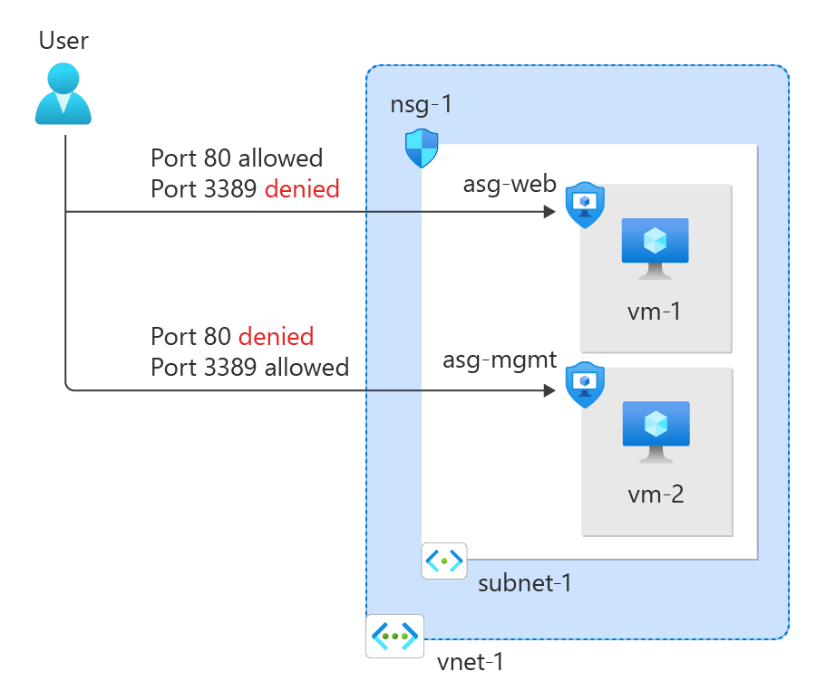
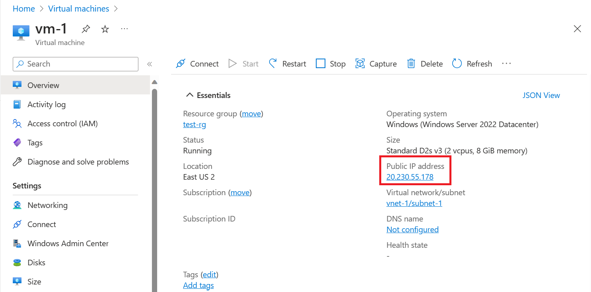

# Filter network traffic with a network security group

## Goal of the Workshop



## Create a Virtual Network

See workshop **Create a virtual network**

## Create Application Security Group
> An application security group (ASGs) enables you to group together servers with similar functions, such as web servers. You can then create security rules based on these groups.

1. In the portal, search for and select **Application security group.** 
2. Select **+Create**.
3. On the Basics tab of Create an application security group, enter or select this information:
    - **Subscription**: Select your subscription.
    - **Resource group**
    - **Name**: Enter a name for your application security group.
    - **Region**: Select the region to create the application security group in.
4. We will create deux ASGs:
    - **Name**: asg-web
    - **Name**: asg-gmt

## Create a Network Security Group

1. In the portal, search for and select **Network security group.**
2. Select **+Create**
3. On the Basics tab of **Create network security group**, enter or select this information:
    - **Subscription**: Select your subscription.
    - **Resource group**
    - **Name**: Enter a name for your network security group.
    - **Region**: Select the region to create the network security group in.
4. Select **Review + Create** and when the validation passes, select **Create**.

## Associate network security group to subnet
1. Select the network security group created earlier.
2. Select Subnets from the Settings section of the nsg.
3. In the Subnets page, select **+Associate**
4. Under Associate subnet, select the vnet that you created before for Virtual network.
5. Select the Subnet, and then select OK.

## Create security rules
1. Select **Inbound security rules** from the Settings section of your NSG.
2. In **Inbound security rules** page, select **+Add**.
3. Create a security rule that allows ports 80 and 443 to the asg-web application security group. In Add inbound security rule page, enter or select the following information:
    - **Source**: Leave the default of Any.
    - **Source port ranges**: Leave the default of (*).
    - **Destination**:  Select Application security group.
    - **Destination application security groups**: Select asg-web.
    - **Service**: Leave the default of Custom.
    - **Destination port ranges**: Enter 80,443.
    - **Protocol**: Select TCP.
    - **Action**: Leave the default of Allow.
    - **Priority**: Leave the default of 100.
    - **Name**: Enter allow-web-all.
4. Select **Add**.
5. Repeat the previous steps with the following information:
    - **Source**: Leave the default of Any.
    - **Source port ranges**: Leave the default of (*).
    - **Destination**:  Select Application security group.
    - **Destination application security groups**: Select asg-mgmt.
    - **Service**:  Select RDP.
    - **Destination port ranges**: Enter 80,443.
    - **Protocol**: Select TCP.
    - **Action**: Leave the default of Allow.
    - **Priority**: Leave the default of 110.
    - **Name**: Enter allow-rdp-all.

## Create Virtual Machines
Create two virtual machines (VMs) in the virtual network.
These Virtual Machine should be build with **Windows Server 2022 Datacenter - x64 Gen2** image.
These Virtual Machine should have a **Public Ip**.

## Associate network interfaces to an ASG
When you created the VMs, Azure created a network interface for each VM, and attached it to the VM.
Add the network interface of each VM to one of the application security groups you created previously:
1. Select vm-1.
2. Select Networking from the Settings section of vm-1.
3. Select the Application security groups tab, then select Configure the application security groups.
4. In Configure the application security groups, select asg-web in the Application security groups pull-down menu, then select Save.
5. Repeat the previous steps for vm-2, selecting asg-mgmt in the Application security groups pull-down menu.

## Test filtered traffic
1. Select vm-2.
2. On the Overview page, select the Connect button and then select Native RDP.
3. Select Download RDP file.
4. Open the downloaded rdp file and select Connect. Enter the username and password you specified when creating the VM.
5.Select OK.
6. You may receive a certificate warning during the connection process. If you receive the warning, select Yes or Continue, to continue with the connection.
The network interface for vm-2 is associated with the asg-mgmt application security group and allows the connection.
7. Open a PowerShell session on vm-2. Connect to vm-1 using the following:
```
mstsc /v:vm-1
```
The RDP connection from vm-2 to vm-1 succeeds because virtual machines in the same network can communicate with each other over any port by default.
You can't create an RDP connection to the vm-1 virtual machine from the internet. The security rule for the asg-web prevents connections to port 3389 inbound from the internet. Inbound traffic from the Internet is denied to all resources by default.
8. To install Microsoft IIS on the vm-1 virtual machine, enter the following command from a PowerShell session on the vm-1 virtual machine:
```
Install-WindowsFeature -name Web-Server -IncludeManagementTools
```
9. After the IIS installation is complete, disconnect from the vm-1 virtual machine, which leaves you in the vm-2 virtual machine remote desktop connection.
10. Disconnect from the vm-2 VM
11. Search for vm-1.
12. On the Overview page of vm-1, note the Public IP address for your VM. The address shown in the following example is 20.230.55.178, your address is different:

14. To confirm that you can access the vm-1 web server from the internet, open an internet browser on your computer and browse to http://<public-ip-address-from-previous-step>.
You see the IIS default page, because inbound traffic from the internet to the asg-web application security group is allowed through port 80.
The network interface attached for vm-1 is associated with the asg-web application security group and allows the connection.
