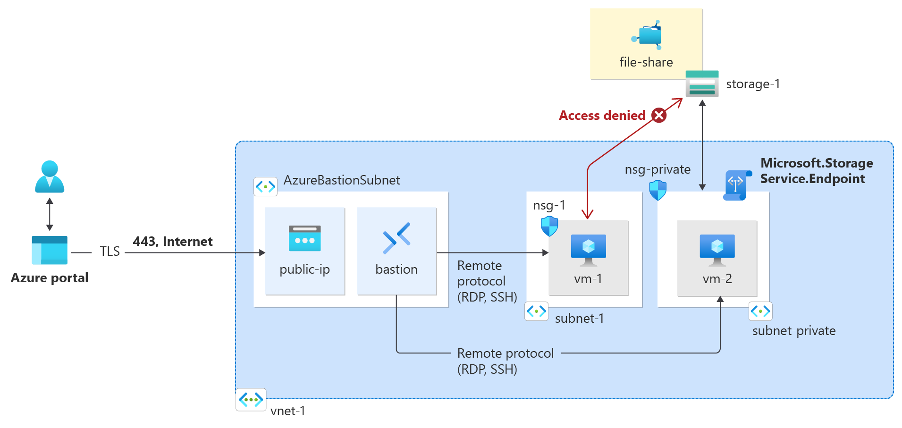
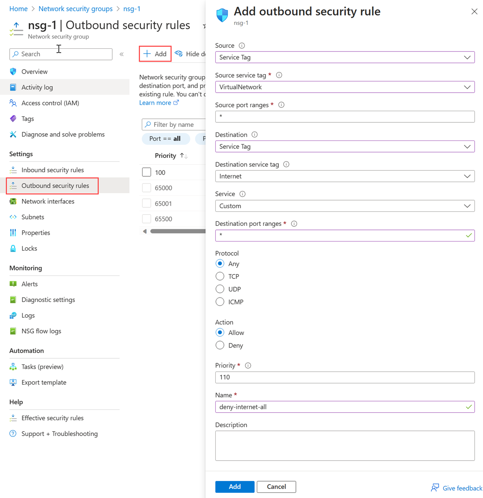
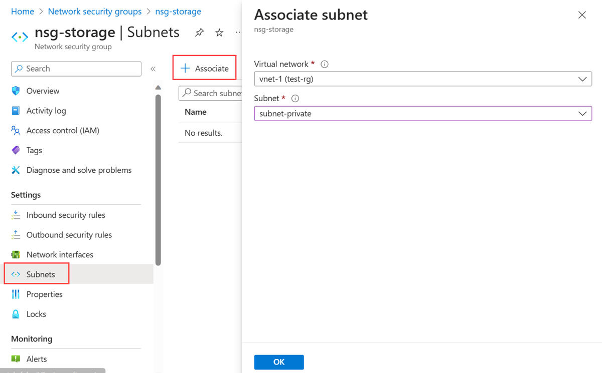
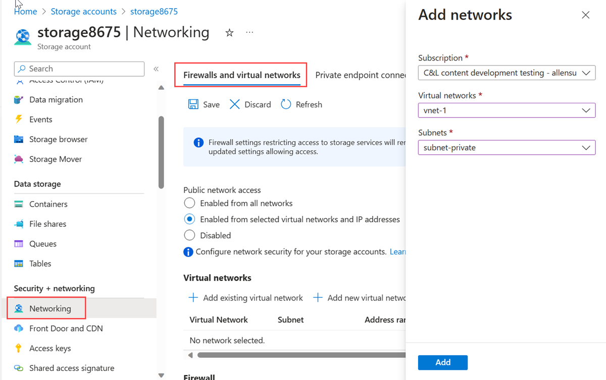
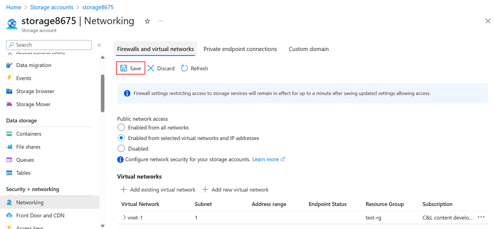
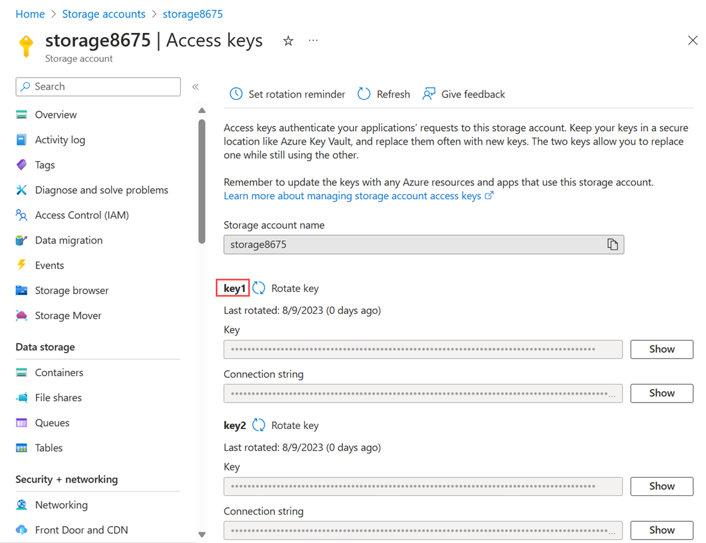
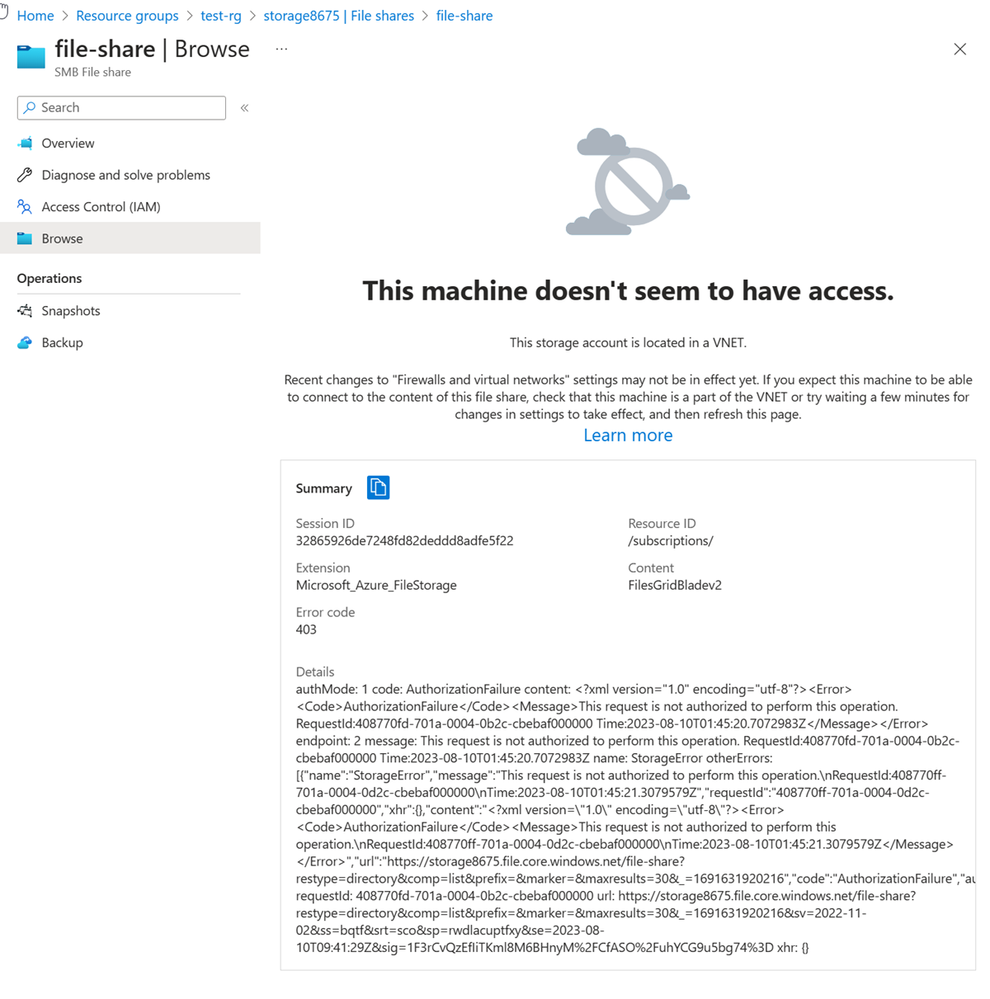

# Restrict network access to PaaS resources with virtual network service endpoints

## Goal of the workshop


## Create a virtual network and bastion host
See VNET creation workshop

## Enable a service endpoint
1. In the portal, search for and select **Virtual networks**.
2. Select the virtual network that you created earlier.
3. Select **Subnets** from the Settings section of the virtual network.
4. Select + Subnet.
5. On the Add subnet page, enter or select the following information:
    - Name subnet-private
    - Subnet address range Leave the default of 10.0.2.0/24.
    - [SERVICE ENDPOINTS] Services Select Microsoft.Storage
6. Select Save.

## Restrict network access for a subnet
By default, all virtual machine instances in a subnet can communicate with any resources. You can limit communication to and from all resources in a subnet by creating a network security group, and associating it to the subnet.

1. In the portal, search for and select **Network security group**.
2. Select **+Create**.
3. In the Basics tab of Create network security group, enter or select the following information:
    - **Subscription**: Select your subscription.
    - **Resource group**: Select the resource group that contains your virtual network.
    - **Name**: Enter nsg-storage.
    - **Region**: Select the region to create the network security group in.    
4. Select **Review + Create** and when the validation passes, select **Create**.

## Create outbound NSG rules
1. Select nsg-storage.
2. Select **Outbound security rules** from the Settings section of your NSG.
3. In **Outbound security rules** page, select **+Add**.
4. Create a rule that allows outbound communication to the Azure Storage service. Enter or select the following information in Add outbound security rule:
    - Source Select Service Tag.
    - Source service tag Select VirtualNetwork.
    - Source port ranges Leave the default of *.
    - Destination Select Service Tag.
    - Destination service tag Select Storage.
    - Service Leave default of Custom.
    - Destination port ranges Enter 445 (SMB protocol is used to connect to a file share created in a later step.) 
    - Protocol Select Any.
    - Action Select Allow.
    - Priority Leave the default of 100.
    - Name Enter allow-storage-all.
5. Select **Add**.
6. Create another outbound security rule that denies communication to the internet. This rule overrides a default rule in all network security groups that allows outbound internet communication. Complete the previous steps with the following values in Add outbound security rule:
    - Source Select Service Tag.
    - Source service tag Select VirtualNetwork.
    - Source port ranges Leave the default of *.
    - Destination Select Service Tag.
    - Destination service tag Select Internet.
    - Service Leave default of Custom.
    - Destination port ranges Enter*.
    - Protocol Select Any.
    - Action Select Deny.
    - Priority Leave the default 110.
    - Name Enter deny-internet-all.

7. Select **Add**.

## Associate the network security group to a subnet
1. Select the network security group created earlier.
2. Select **Subnets** from the Settings section of the nsg.
3. In the Subnets page, select **+Associate**
4. Under Associate subnet, select the vnet that you created before for Virtual network.

5. Select the Subnet, and then select OK.

## Restrict network access to a resource

The steps required to restrict network access to resources created through Azure services, which are enabled for service endpoints vary across services. See the documentation for individual services for specific steps for each service. The rest of this tutorial includes steps to restrict network access for an Azure Storage account, as an example.

## Create a storage account
1. In the portal, search for and select **Storage accounts**.
2. Select **+Create**.
3. In the Basics tab of Create a storage account enter or select the following information:
    - Subscription Select your Azure subscription.
    - Resource Group Select test-rg.
    - Instance details 
    - Storage account name Enter storage1. If the name is unavailable, enter a unique name.
    - Location Select the region to create the storage account in.
    - Performance Leave the default Standard.
    - Redundancy Select Locally-redundant storage (LRS).
4. Select **Review + Create** and when the validation passes, select **Create**.

## Create a file share in the storage account
1. In the portal, search for and select **Storage accounts**.
2. Select the storage account that you created earlier.
3. Select **File shares** from the Services section of the storage account.
4. Select **+File share**.
5. In the Create file share page, enter or select the following information:
    - Name Enter file-share.
    - Tier Leave the default of Transaction optimized.
6. Select Next: Backup.
7. Deselect Enable backup.
8. Select Review + create, then select Create.

## Restrict network access to a subnet
By default, storage accounts accept network connections from clients in any network, including the internet. You can restrict network access from the internet, and all other subnets in all virtual networks (except the subnet-private subnet in the vnet-1 virtual network.)
To restrict network access to a subnet:
1. In the portal, search for and select **Storage accounts**.
2. Select the storage account that you created earlier.
3. Select **Firewalls and virtual networks** from the Settings section of the storage account.
4. In the Firewalls and virtual networks tab, select Enabled from selected virtual networks and IP addresses in Public network access.
5. Select **+Add existing virtual network**.
6. In the Add existing virtual network page, enter or select the following information:
    - Resource group Select test-rg.
    - Virtual network Select vnet-1.
    - Subnet Select subnet-private.

7. Select Add.
8. Select Save.


## Create test virtual machine
1. In the portal, search for and select **Virtual machines**.
2. Select **+Create**.
3. On the Basics tab of Create a virtual machine, enter or select the following information:
    - Subscription Select your subscription.
    - Resource group Select test-rg.
    - Virtual machine name Enter vm-1.
    - Region 
    - Availability options Select No infrastructure redundancy required.
    - Security type Leave the default of Standard.
    - Image Select Windows Server 2022 Datacenter - x64 Gen2.
    - VM architecture Leave the default of x64.
    - Size Select a size.
    - Authentication type Select Password.
    - Username Enter azureuser.
    - Password Enter a password.
    - Public inbound ports Select None.
4. Select the Networking tab at the top of the page.
5. In the Networking tab, enter or select the following information:
    - Virtual network Select vnet-1.
    - Subnet Select subnet-1.
    - Public IP Select None.
    - NIC network security group Select Advanced.
    - configure network security group Select Create new.
    - Enter nsg-1 for the name.
6.Leave the rest at the defaults and select OK.
7. Repeat the steps in the previous section to create a second virtual machine. Replace the following values in Create a virtual machine:
    - Virtual machine name Enter vm-private.
    - Subnet Select subnet-private.
    - Public IP Select None.
    - NIC network security group Select None.

## Get storage account access key
1. In the portal, search for and select **Storage accounts**.
2. Select the storage account that you created earlier.
3. In Security + networking, select Access keys.
4. Copy the value of Key1.

5. n the search box at the top of the portal, enter Virtual machine. Select Virtual machines in the search results.
6.Select vm-private.
7. Select Bastion in Operations.
8. Enter the username and password you specified when creating the virtual machine. Select Connect.
9. Open Windows PowerShell. Use the following script to map the Azure file share to drive Z.
    - Replace <storage-account-key> with the key you copied in the previous step.
    - Replace <storage-account-name> with the name of your storage account. In this example, it's storage8675.  
```
$key = @{
     String = "<storage-account-key>"
 }
 $acctKey = ConvertTo-SecureString @key -AsPlainText -Force

 $cred = @{
     ArgumentList = "Azure\<storage-account-name>", $acctKey
 }
 $credential = New-Object System.Management.Automation.PSCredential @cred

 $map = @{
     Name = "Z"
     PSProvider = "FileSystem"
     Root = "\\<storage-account-name>.file.core.windows.net\file-share"
     Credential = $credential
 }
 New-PSDrive @map
```
PowerShell returns output similar to the following example output:
```python
Name        Used (GB)     Free (GB) Provider      Root
----        ---------     --------- --------      ----
Z                                      FileSystem    \\storage8675.file.core.windows.net\f...
```

## Confirm access is denied to storage account
### From VM-1
1. In the search box at the top of the portal, enter Virtual machine. Select Virtual machines in the search results.
2. Select vm-1.
3. Select Bastion in Operations.
4. Enter the username and password you specified when creating the virtual machine. Select Connect.
5. Repeat the previous command to attempt to map the drive to the file share in the storage account. You may need to copy the storage account access key again for this procedure:

```PowerShell
Copy
$key = @{
    String = "<storage-account-key>"
}
$acctKey = ConvertTo-SecureString @key -AsPlainText -Force

$cred = @{
    ArgumentList = "Azure\<storage-account-name>", $acctKey
}
$credential = New-Object System.Management.Automation.PSCredential @cred

$map = @{
    Name = "Z"
    PSProvider = "FileSystem"
    Root = "\\<storage-account-name>.file.core.windows.net\file-share"
    Credential = $credential
}
New-PSDrive @map
```
You should receive the following error message:
```PowerShell
New-PSDrive : Access is denied
At line:1 char:5
- New-PSDrive @map
- ~~~~~~~~~~~~~~~~
  - CategoryInfo          : InvalidOperation: (Z:PSDriveInfo) [New-PSDrive], Win32Exception
  - FullyQualifiedErrorId : CouldNotMapNetworkDrive,Microsoft.PowerShell.Commands.NewPSDriveCommand
```
6. Close the Bastion connection to vm-1.

### From a local machine:
1. In the search box at the top of the portal, enter Storage account. Select Storage accounts in the search results.
2. In Storage accounts, select your storage account.
3.In Data storage, select File shares.
4. Select file-share.
5. Select Browse in the left-hand menu.
You should receive the following error message:

The access is denied because your computer isn't in the subnet-private subnet of the vnet-1 virtual network.
