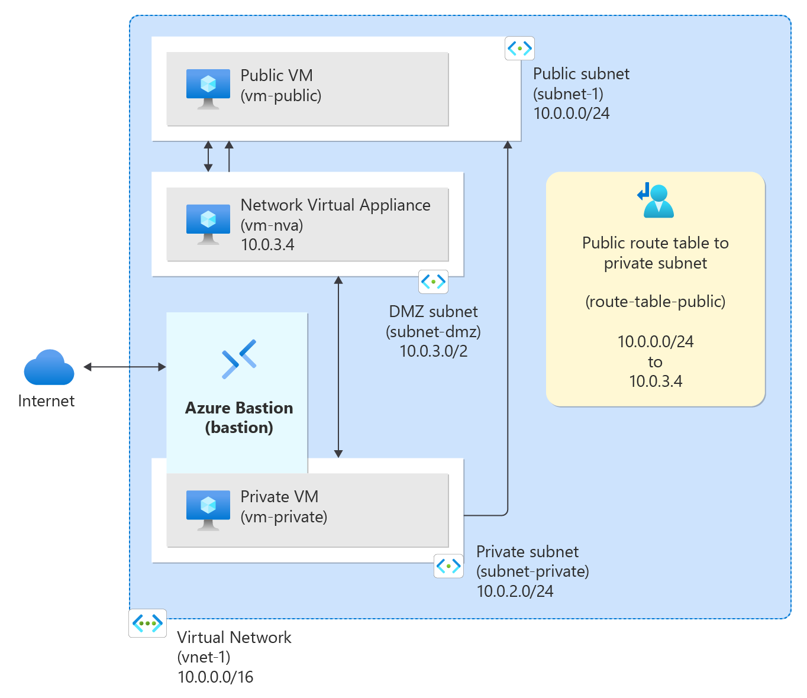
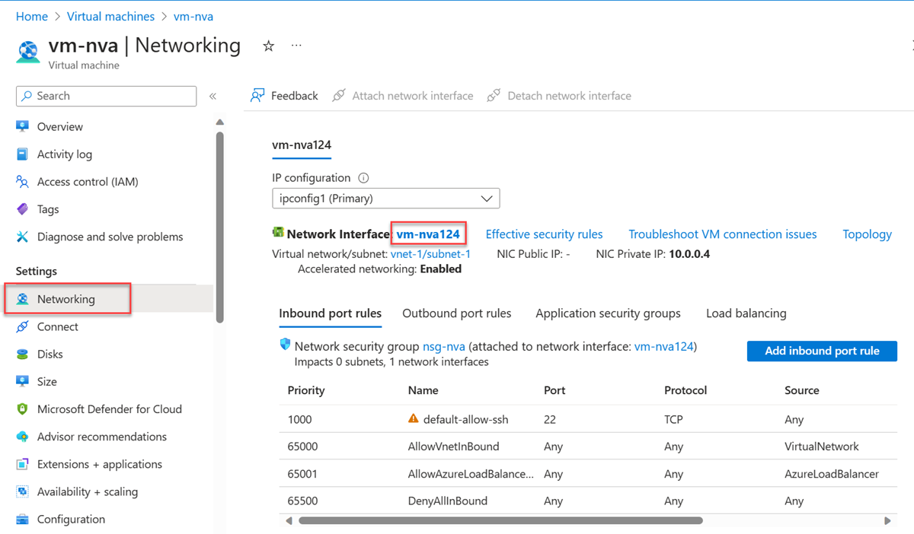
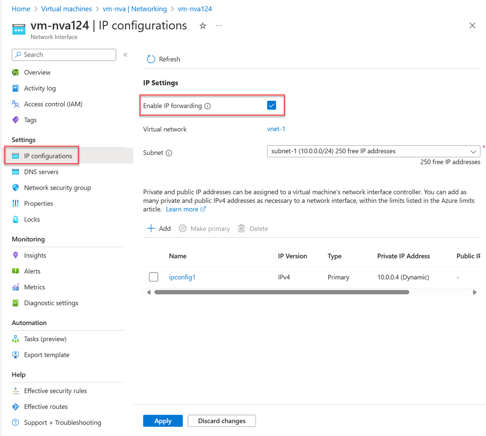
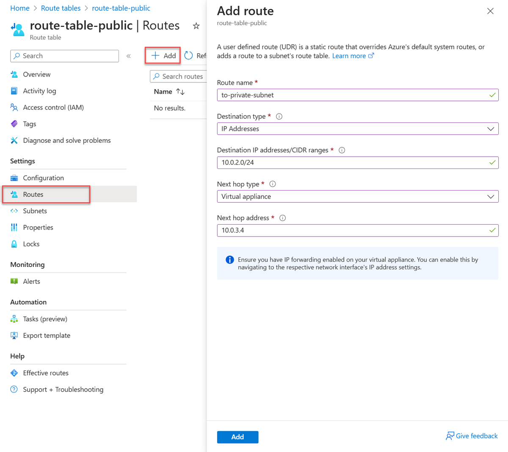

# Route network traffic with a route table

## Goal of the Workshop


## Create a virtual network and bastion host
See workshop **Create a virtual network**

## Create subnets
A DMZ and Private subnet are needed for this tutorial. The DMZ subnet is where you deploy the NVA, and the Private subnet is where you deploy the virtual machines that you want to route traffic to. 

1. In the portal, search for and select **Virtual networks**.
2. In Virtual networks, select the vnet you created earlier.
3. In the virtual network's subnet list, select + Subnet.
4. In Add subnet, enter or select the following information : 
    - name : subnet-private.
5. Select Save.
6. Select + Subnet.
7. In Add subnet, enter or select the following information : 
    - name : subnet-dmz.
8. Select Save.

## Create an NVA virtual machine
Network virtual appliances (NVAs) are virtual machines that help with network functions, such as routing and firewall optimization

1. In the portal, search for and select **Virtual machines**.
2. Select + Create then Azure virtual machine.
3. In Create a virtual machine enter or select the following information in the Basics tab
    - Subscription Select your subscription.
    - Resource group Select test-rg.
    - Virtual machine name Enter vm-nva.
    - Region Select the region to create the virtual machine in.
    - Availability options Select No infrastructure redundancy required.
    - Security type Select Standard.
    - Image Select Ubuntu Server 22.04 LTS - x64 Gen2.
    - VM architecture Leave the default of x64.
    - Size Select a size.
    - Administrator account 
    - Authentication type Select Password.
    - Username Enter a username.
    - Password Enter a password.
    - Public inbound ports Select None.
4. Select Next: Disks then Next: Networking.
5. In the Networking tab, enter or select the following information:
    - Virtual network Select the vnet you created earlier.
    - Subnet Select subnet-dmz.
    - Public IP Select None.
    - NIC network security group Select Advanced.
    - Configure network security group : Select Create new, In Name enter nsg-nva then Select OK.
6. Leave the rest of the options at the defaults and select Review + create.
7. Select Create.

## Create public virtual machine
1. In the portal, search for and select **Virtual machines**.
2. Select + Create then Azure virtual machine.
3. In Create a virtual machine enter or select the following information in the Basics tab:
    - Subscription Select your subscription.
    - Resource group Select test-rg.
    - Virtual machine name Enter vm-public.
    - Region : Select the region to create the virtual machine in.
    - Availability options Select No infrastructure redundancy required.
    - Security type Select Standard.
    - Image Select Ubuntu Server 22.04 LTS - x64 Gen2.
    - VM architecture Leave the default of x64.
    - Size Select a size.
    - Authentication type Select Password.
    - Username Enter a username.
    - Password Enter a password.
    - Public inbound ports Select None.
4. Select Next: Disks then Next: Networking.
5. In the Networking tab, enter or select the following information:
    - Virtual network Select the vnet you created earlier.
    - Subnet Select subnet-1
    - Public IP Select None.
    - NIC network security group Select None.
6. Leave the rest of the options at the defaults and select Review + create.
7. Select Create.

## Create private virtual machine
1. In the portal, search for and select **Virtual machines**.
2. Select + Create then Azure virtual machine.
3. In Create a virtual machine enter or select the following information in the Basics tab:
    - Subscription Select your subscription.
    - Resource group Select test-rg.
    - Virtual machine name Enter vm-private..
    - Region : Select the region to create the virtual machine in.
    - Availability options Select No infrastructure redundancy required.
    - Security type Select Standard.
    - Image Select Ubuntu Server 22.04 LTS - x64 Gen2.
    - VM architecture Leave the default of x64.
    - Size Select a size.
    - Authentication type Select Password.
    - Username Enter a username.
    - Password Enter a password.
    - Public inbound ports Select None.
4. Select Next: Disks then Next: Networking.
5. In the Networking tab, enter or select the following information:
    - Virtual network Select the vnet you created earlier.
    - Subnet Select subnet-private
    - Public IP Select None.
    - NIC network security group Select None.
6. Leave the rest of the options at the defaults and select Review + create.
7. Select Create.

## Enable IP forwarding in Azure
To route traffic through the NVA, turn on IP forwarding in Azure and in the operating system of vm-nva. When IP forwarding is enabled, any traffic received by vm-nva that's destined for a different IP address, isn't dropped and is forwarded to the correct destination.
1. In the portal, search for and select **Virtual machines**.
2. Select vm-nva.
3.In vm-nva, select Networking from the Settings section.
4. Select the name of the interface next to Network Interface:. The name begins with vm-nva and has a random number assigned to the interface. The name of the interface in this example is vm-nva124.

5. In the network interface overview page, select IP configurations from the Settings section.
6. In IP configurations, select the box next to Enable IP forwarding.

7. Select Apply.

## Enable IP forwarding in the operating system
In this section, turn on IP forwarding for the operating system of the vm-nva virtual machine to forward network traffic. Use the Azure Bastion service to connect to the vm-nva virtual machine.
1. In the search box at the top of the portal, enter Virtual machine. Select Virtual machines in the search results.
2. In Virtual machines, select vm-nva.
3. Select Bastion in the Operations section.
4. Enter the username and password you entered when the virtual machine was created.
5. Select Connect.
6. Enter the following information at the prompt of the virtual machine to enable IP forwarding:
```python
sudo vim /etc/sysctl.conf
```
7. In the Vim editor, remove the # from the line net.ipv4.ip_forward=1:
```python
# Uncomment the next line to enable packet forwarding for IPv4
net.ipv4.ip_forward=1
```
8. Close the Bastion session.
9.Restart the virtual machine.

## Create a route table
In this section, create a route table to define the route of the traffic through the NVA virtual machine. The route table is associated to the subnet-1 subnet where the vm-public virtual machine is deployed.

1. In the portal, search for and select **Route tables**.
2. Select + Create.
3. In Create Route table enter or select the following information:
    - Subscription Select your subscription.
    - Resource group Select test-rg.
    - Name Enter route-table-public.
    - Region Select the region to create the route table in.
    - Name Enter route-table-public.
    - Propagate gateway routes Leave the default of Yes.
4. Select Review + create.
5. Select Create.

## Create a route
In this section, create a route in the route table that you created in the previous steps.
1. In the portal, search for and select **Route tables**.
2. Select route-table-public.
3. In Settings select Routes.
4. Select + Add.
5. Enter or select the following information in Add route:
    - Route name Enter to-private-subnet.
    - Destination type Select IP Addresses.
    - Destination IP addresses/CIDR ranges Enter 10.0.2.0/24.
    - Next hop type Select Virtual appliance.
    - Next hop address Enter 10.0.3.4 (This is the IP address you of vm-nva you created in the earlier steps..)

6. Select Add.
7. Select Subnets in Settings.
8. Select + Associate.
9. Enter or select the following information in Associate subnet:
    - Virtual network Select vnet-1 (test-rg).
    - Subnet Select subnet-1.
10. Select OK.

## Test the routing of network traffic
Test routing of network traffic from vm-public to vm-private. Test routing of network traffic from vm-private to vm-public.
1. In the search box at the top of the portal, enter Virtual machine. Select Virtual machines in the search results.
2. In Virtual machines, select vm-public.
3. Select Bastion in the Operations section.
4. Enter the username and password you entered when the virtual machine was created.
5. elect Connect.
6. In the prompt, enter the following command to trace the routing of network traffic from vm-public to vm-private:
```
tracepath vm-private
```
Responce 
```python
azureuser@vm-public:~$ tracepath vm-private
 1?: [LOCALHOST]                      pmtu 1500
 1:  vm-nva.internal.cloudapp.net                          1.766ms
 1:  vm-nva.internal.cloudapp.net                          1.259ms
 2:  vm-private.internal.cloudapp.net                      2.202ms reached
 Resume: pmtu 1500 hops 2 back 1
```
You can see that there are two hops in the above response for tracepath ICMP traffic from vm-public to vm-private. The first hop is vm-nva. The second hop is the destination vm-private.
Azure sent the traffic from subnet-1 through the NVA and not directly to subnet-private because you previously added the to-private-subnet route to route-table-public and associated it to subnet-1.
7. Close the Bastion session.

## Test network traffic from vm-private to vm-public
1. In the search box at the top of the portal, enter Virtual machine. Select Virtual machines in the search results.
2. In Virtual machines, select vm-private. 
3. Select Bastion in the Operations section.
4. Enter the username and password you entered when the virtual machine was created.
5 .Select Connect.
6. In the prompt, enter the following command to trace the routing of network traffic from vm-private to vm-public:
```
tracepath vm-public
```
Response
```python
azureuser@vm-private:~$ tracepath vm-public
 1?: [LOCALHOST]                      pmtu 1500
 1:  vm-public.internal.cloudapp.net                       2.584ms reached
 1:  vm-public.internal.cloudapp.net                       2.147ms reached
 Resume: pmtu 1500 hops 1 back 2
```
You can see that there's one hop in the above response, which is the destination vm-public.
Azure sent the traffic directly from subnet-private to subnet-1. By default, Azure routes traffic directly between subnets.
7. Close the Bastion session.
