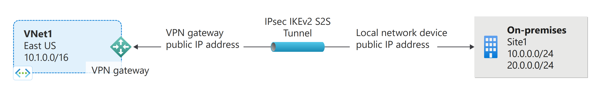
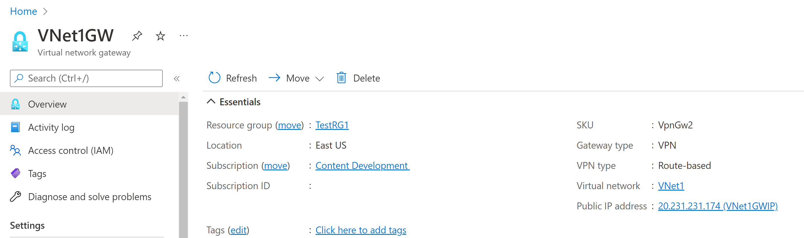
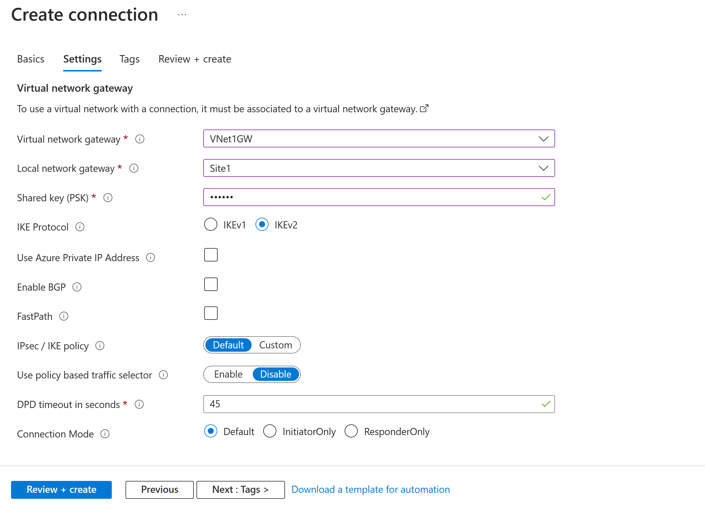

# Create a site-to-site VPN connection

## Goal of the Workshop

## Create a virtual network
In this section, you'll create a virtual network (VNet) using the following values:
- Resource group: TestRG1
- Name: VNet1
- Region: West Europe
- IPv4 address space: 10.1.0.0/16
- Subnet name: FrontEnd
- Subnet address space: 10.1.0.0/24

Sign in to the Azure portal.

In Search resources, service, and docs (G+/) at the top of the portal page, type virtual network. Select Virtual network from the Marketplace results to open the Virtual network page.

On the Virtual network page, select Create. This opens the Create virtual network page.

On the Basics tab, configure the VNet settings for Project details and Instance details. You'll see a green check mark when the values you enter are validated. The values shown in the example can be adjusted according to the settings that you require.

- Subscription: Verify that the subscription listed is the correct one. You can change subscriptions by using the drop-down.
- Resource group: Select an existing resource group, or select Create new to create a new one. For more information about resource groups, see Azure Resource Manager overview.
- Name: Enter the name for your virtual network.
- Region: Select the location for your VNet. The location determines where the resources that you deploy to this VNet will live.

Select Next or Security to advance to the Security tab. For this exercise, leave the default values for all the services on this page.

Select IP Addresses to advance to the IP Addresses tab. On the IP Addresses tab, configure the settings.

- IPv4 address space: By default, an address space is automatically created. You can select the address space and adjust it to reflect your own values. You can also add a different address space and remove the default that was automatically created. For example, you can specify the starting address as 10.1.0.0 and specify the address space size as /16, then Add that address space.
- Add subnet: If you use the default address space, a default subnet is created automatically. If you change the address space, add a new subnet within that address space. Select + Add subnet to open the Add subnet window. Configure the following settings, then select Add at the bottom of the page to add the values.
    - Subnet name: Example: FrontEnd
    - Subnet address range: The address range for this subnet. For example, 10.1.0.0 and /24.

Review the IP addresses page and remove any address spaces or subnets that you don't need.

Select Review + create to validate the virtual network settings.

After the settings have been validated, select Create to create the virtual network.

## Create a VPN gateway
reate a virtual network gateway (VPN gateway) using the following values:
- Name: VNet1GW
- Region: West Europe
- Gateway type: VPN
- SKU: VpnGw2
- Generation: Generation 2
- Virtual network: VNet1
- Gateway subnet address range: 10.1.255.0/27
- Public IP address: Create new
- Public IP address name: VNet1GWpip
- Enable active-active mode: Disabled
- Configure BGP: Disabled

In Search resources, services, and docs (G+/) type virtual network gateway. Locate Virtual network gateway in the Marketplace search results and select it to open the Create virtual network gateway page.

On the Basics tab, fill in the values for Project details and Instance details.

- Subscription: Select the subscription you want to use from the dropdown.
- Resource Group: This setting is autofilled when you select your virtual network on this page.
- Name: Name your gateway. Naming your gateway not the same as naming a gateway subnet. It's the name of the gateway object you're creating.
- Region: Select the region in which you want to create this resource. The region for the gateway must be the same as the virtual network.
- Gateway type: Select VPN. VPN gateways use the virtual network gateway type VPN.
- SKU: Select the gateway SKU that supports the features you want to use from the dropdown. See Gateway SKUs. In the portal, the SKUs available in the dropdown depend on the VPN type you select. The Basic SKU can only be configured using Azure CLI or PowerShell. You can't configure the Basic SKU in the Azure portal.
- Generation: Select the generation you want to use. We recommend using a Generation2 SKU. For more information, see Gateway SKUs.
- Virtual network: From the dropdown, select the virtual network to which you want to add this gateway. If you can't see the VNet for which you want to create a gateway, make sure you selected the correct subscription and region in the previous settings.
- Gateway subnet address range: This field only appears if your VNet doesn't have a gateway subnet. It's best to specify /27 or larger (/26,/25 etc.). This allows enough IP addresses for future changes, such as adding an ExpressRoute gateway. If you already have a gateway subnet, you can view GatewaySubnet details by navigating to your virtual network. Select Subnets to view the range. If you want to change the range, you can delete and recreate the GatewaySubnet.

Specify in the values for Public IP address. These settings specify the public IP address object that gets associated to the VPN gateway. The public IP address is assigned to this object when the VPN gateway is created. The only time the primary public IP address changes is when the gateway is deleted and re-created. It doesn't change across resizing, resetting, or other internal maintenance/upgrades of your VPN gateway.

- Public IP address type: For this exercise, if you have the option to choose the address type, select Standard.
- Public IP address: Leave Create new selected.
- Public IP address name: In the text box, type a name for your public IP address instance.
- Public IP address SKU: Setting is autoselected.
- Assignment: The assignment is typically autoselected and can be either Dynamic or Static.
- Enable active-active mode: Select Disabled. Only enable this setting if you're creating an active-active gateway configuration.
- Configure BGP: Select Disabled, unless your configuration specifically requires this setting. If you do require this setting, the default ASN is 65515, although this value can be changed.

Select Review + create to run validation.

Once validation passes, select Create to deploy the VPN gateway.

You can see the deployment status on the Overview page for your gateway. A gateway can take up to 45 minutes to fully create and deploy. After the gateway is created, you can view the IP address that has been assigned to it by looking at the virtual network in the portal. The gateway appears as a connected device.

## View the public IP address
You can view the gateway public IP address on the Overview page for your gateway.

To see additional information about the public IP address object, select the name/IP address link next to Public IP address.

## Create a local network gateway
The local network gateway is a specific object that represents your on-premises location (the site) for routing purposes. You give the site a name by which Azure can refer to it, then specify the IP address of the on-premises VPN device to which you'll create a connection. You also specify the IP address prefixes that will be routed through the VPN gateway to the VPN device. The address prefixes you specify are the prefixes located on your on-premises network. If your on-premises network changes or you need to change the public IP address for the VPN device, you can easily update the values later.

Create a local network gateway using the following values:
- Name: Site1
- Resource Group: TestRG1
- Location: East US

From the Azure portal, in Search resources, services, and docs (G+/) type local network gateway. Locate local network gateway under Marketplace in the search results and select it. This opens the Create local network gateway page.

On the Create local network gateway page, on the Basics tab, specifiy the values for your local network gateway.

- Subscription: Verify that the correct subscription is showing.
- Resource Group: Select the resource group that you want to use. You can either create a new resource group, or select one that you've already created.
- Region: Select the region that this object will be created in. You may want to select the same location that your VNet resides in, but you aren't required to do so.
- Name: Specify a name for your local network gateway object.
- Endpoint: Select the endpoint type for the on-premises VPN device - IP address or FQDN (Fully Qualified Domain Name).
- IP address: Specify the public IP address of the on-premises VPN device. If you selected FQDN, specify the FQDN of the on-premises VPN device.
  - IP address: If you have a static public IP address allocated from your Internet service provider for your VPN device, select the IP address option and fill in the IP address as shown in the example. This is the public IP address of the VPN device that you want Azure VPN gateway to connect to. If you don't have the IP address right now, you can use the values shown in the example, but you'll need to go back and replace your placeholder IP address with the public IP address of your VPN device. Otherwise, Azure won't be able to connect.
  - FQDN: If you have a dynamic public IP address that could change after certain period of time, often determined by your Internet service provider, you can use a constant DNS name with a Dynamic DNS service to point to your current public IP address of your VPN device. Your Azure VPN gateway resolves the FQDN to determine the public IP address to connect to.
Address Space refers to the address ranges for the network that this local network represents. You can add multiple address space ranges. Make sure that the ranges you specify here don't overlap with ranges of other networks that you want to connect to. Azure routes the address range that you specify to the on-premises VPN device IP address. Use your own values here if you want to connect to your on-premises site.

On the Advanced tab, you can configure BGP settings if needed.

When you have finished specifying the values, select Review + create at the bottom of the page to validate the page.

Select Create to create the local network gateway object.

## Configure your VPN device
Site-to-site connections to an on-premises network require a VPN device. In this step, you configure your VPN device. When configuring your VPN device, you need the following values:

- A shared key. This is the same shared key that you specify when creating your site-to-site VPN connection. In our examples, we use a basic shared key. We recommend that you generate a more complex key to use.
- The public IP address of your virtual network gateway. You can view the public IP address by using the Azure portal, PowerShell, or CLI. To find the public IP address of your VPN gateway using the Azure portal, go to Virtual network gateways, then select the name of your gateway.

To download VPN device configuration scripts: Depending on the VPN device that you have, you may be able to download a VPN device configuration script. For more information, see Download VPN device configuration scripts (<https://learn.microsoft.com/en-us/azure/vpn-gateway/vpn-gateway-download-vpndevicescript>)

## Create VPN connections
Create a site-to-site VPN connection between your virtual network gateway and your on-premises VPN device.

Create a connection using the following values:
- Local network gateway name: Site1
- Connection name: VNet1toSite1
- Shared key: For this example, we use abc123. But, you can use whatever is compatible with your VPN hardware. The important thing is that the values match on both sides of the connection.

Go to your virtual network. On your VNet page, select Connected devices on the left. Locate your VPN gateway and click to open it.

On the page for the gateway, select Connections.

At the top of the Connections page, select +Add to open the Create connection page.

On the Create connection Basics page, configure the values for your connection.

- For Project details, select the subscription and the Resource group where your resources are located.
- For Instance details, configure the following settings:
    - Connection type: Select Site-to-site (IPSec).
    - Name: Name your connection.
    - Region: Select the region for this connection.

Select Settings to navigate to the settings page.

- Virtual network gateway: Select the virtual network gateway from the dropdown.
- Local network gateway: Select the local network gateway from the dropdown.
- Shared Key: the value here must match the value that you're using for your local on-premises VPN device.
- Select IKEv2.
- Leave Use Azure Private IP Address deselected.
- Leave Enable BGP deselected.
- Leave FastPath deselected.
- IPse/IKE policy: Default.
- Use policy based traffic selector: Disable.
- DPD timeout in seconds: 45
- Connection Mode: leave as Default. This setting is used to specify which gateway can initiate the connection. For more information, see <https://learn.microsoft.com/en-us/azure/vpn-gateway/vpn-gateway-about-vpn-gateway-settings#connectionmode>

For NAT Rules Associations, leave both Ingress and Egress as 0 selected.

Select Review + create to validate your connection settings.

Select Create to create the connection.

Once the deployment is complete, you can view the connection in the Connections page of the virtual network gateway. The Status goes from Unknown to Connecting, and then to Succeeded.

#### To configure additional connection settings (optional)
Go to your virtual network gateway and select Connections to open the Connections page.

Select the name of the connection you want to configure to open the Connection page.

On the Connection page left side, select Configuration to open the Configuration page. Make any necessary changes, then Save.

In the following screenshot, we've enabled all the settings to show you the configuration settings available in the portal. Click the screenshot to see the expanded view. When you configure your connections, only configure the settings that you require. Otherwise, leave the default settings in place.

## Verify the VPN connection
In the Azure portal menu, select All resources or search for and select All resources from any page.

Select to your virtual network gateway.

On the blade for your virtual network gateway, click Connections. You can see the status of each connection.

Click the name of the connection that you want to verify to open Essentials. In Essentials, you can view more information about your connection. The Status is 'Succeeded' and 'Connected' when you have made a successful connection.

## Connect to a virtual machine
Locate the private IP address. You can find the private IP address of a VM by either looking at the properties for the VM in the Azure portal. Locate your virtual machine in the Azure portal. View the properties for the VM. The private IP address is listed.

Verify that you're connected to your VNet.

Open Remote Desktop Connection by typing "RDP" or "Remote Desktop Connection" in the search box on the taskbar, then select Remote Desktop Connection. You can also open Remote Desktop Connection using the 'mstsc' command in PowerShell.

In Remote Desktop Connection, enter the private IP address of the VM. You can select "Show Options" to adjust additional settings, then connect.

