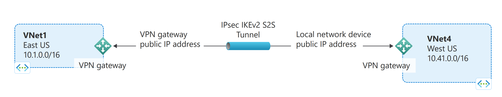
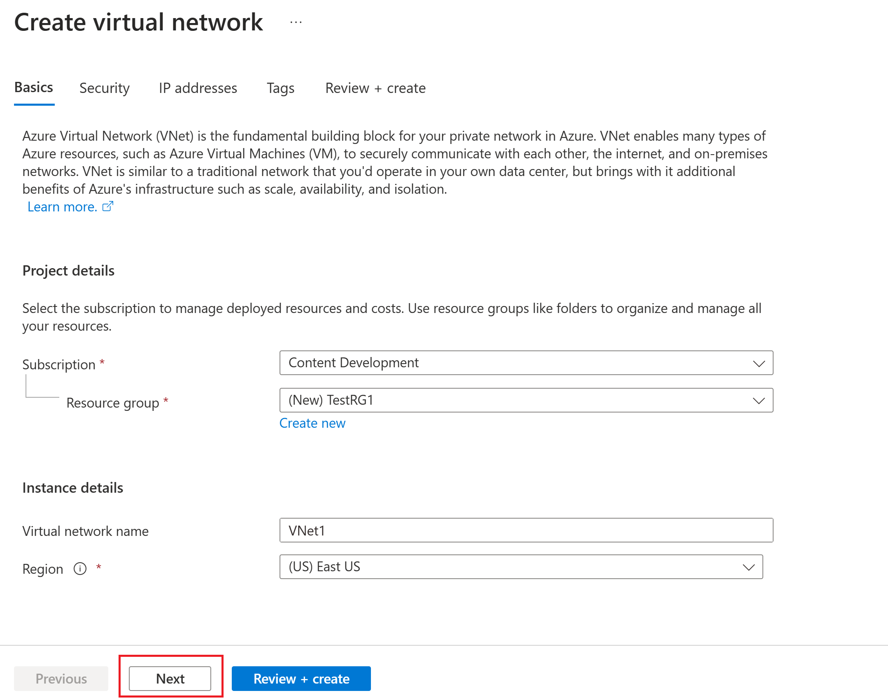
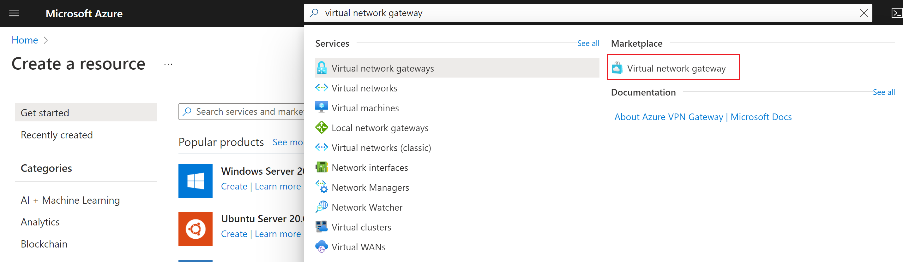
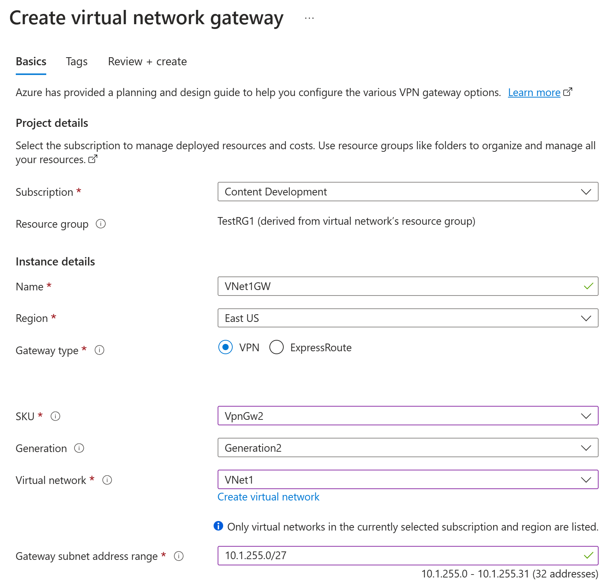
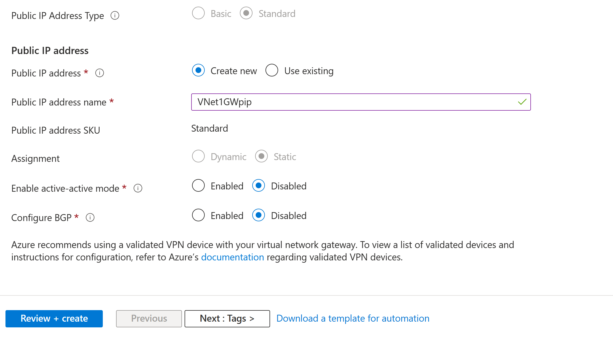
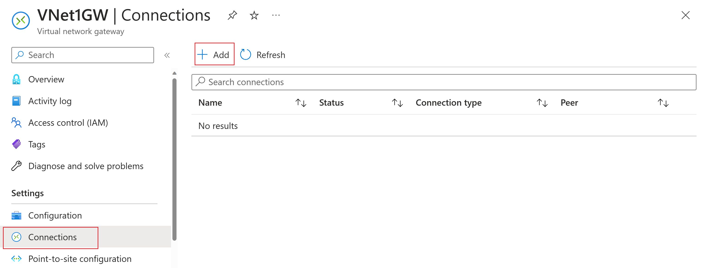
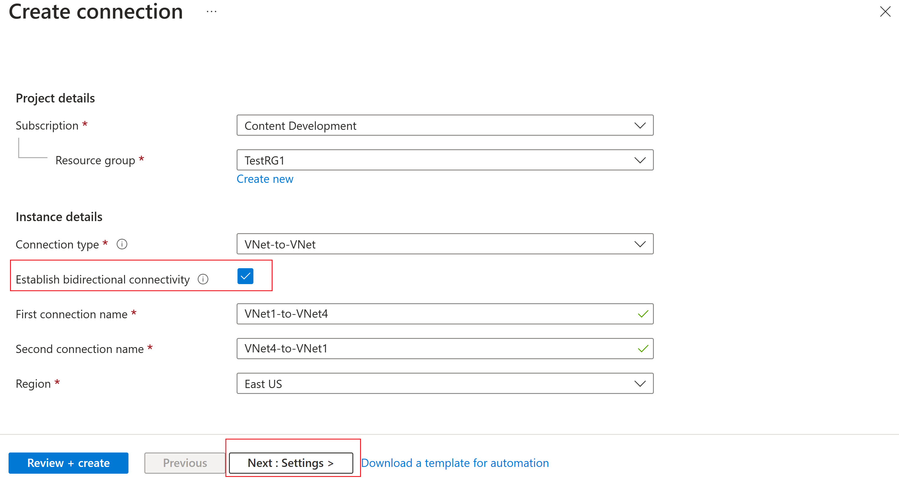

# Configure a VNet-to-VNet VPN gateway connection

## Goal of the workshop


## Create and configure VNet1
Sign in to the Azure portal.

In Search resources, service, and docs (G+/) at the top of the portal page, type virtual network. Select Virtual network from the Marketplace results to open the Virtual network page.

On the Virtual network page, select Create. This opens the Create virtual network page.

On the Basics tab, configure the VNet settings for Project details and Instance details. You'll see a green check mark when the values you enter are validated. The values shown in the example can be adjusted according to the settings that you require.



- Subscription: Verify that the subscription listed is the correct one. You can change subscriptions by using the drop-down.
- Resource group: Select an existing resource group, or select Create new to create a new one. For more information about resource groups, see Azure Resource Manager overview.
- Name: Enter the name for your virtual network.
- Region: Select the location for your VNet. The location determines where the resources that you deploy to this VNet will live.

Select Next or Security to advance to the Security tab. For this exercise, leave the default values for all the services on this page.

Select IP Addresses to advance to the IP Addresses tab. On the IP Addresses tab, configure the settings.

- IPv4 address space: By default, an address space is automatically created. You can select the address space and adjust it to reflect your own values. You can also add a different address space and remove the default that was automatically created. For example, you can specify the starting address as 10.1.0.0 and specify the address space size as /16, then Add that address space.
- Add subnet: If you use the default address space, a default subnet is created automatically. If you change the address space, add a new subnet within that address space. Select + Add subnet to open the Add subnet window. Configure the following settings, then select Add at the bottom of the page to add the values.
  - Subnet name: Example: FrontEnd.
  - Subnet address range: The address range for this subnet. For example, 10.1.0.0 and /24.

Review the IP addresses page and remove any address spaces or subnets that you don't need.

Select Review + create to validate the virtual network settings.

After the settings have been validated, select Create to create the virtual network.

## Create the VNet1 gateway
In this step, you create the virtual network gateway for your VNet. Creating a gateway can often take 45 minutes or more, depending on the selected gateway SKU.

The virtual network gateway uses specific subnet called the gateway subnet. The gateway subnet is part of the virtual network IP address range that you specify when configuring your virtual network. It contains the IP addresses that the virtual network gateway resources and services use.

When you create the gateway subnet, you specify the number of IP addresses that the subnet contains. The number of IP addresses needed depends on the VPN gateway configuration that you want to create. Some configurations require more IP addresses than others. It's best to specify /27 or larger (/26,/25 etc.) for your gateway subnet.

```
If you see an error that specifies that the address space overlaps with a subnet, or that the subnet isn't contained within the address space for your virtual network, check your VNet address range. You may not have enough IP addresses available in the address range you created for your virtual network. For example, if your default subnet encompasses the entire address range, there are no IP addresses left to create additional subnets. You can either adjust your subnets within the existing address space to free up IP addresses, or specify an additional address range and create the gateway subnet there.
```

### To create a virtual network gateway
In Search resources, services, and docs (G+/) type virtual network gateway. Locate Virtual network gateway in the Marketplace search results and select it to open the Create virtual network gateway page.



On the Basics tab, fill in the values for Project details and Instance details.



- Subscription: Select the subscription you want to use from the dropdown.
- Resource Group: This setting is autofilled when you select your virtual network on this page.
- Name: Name your gateway. Naming your gateway not the same as naming a gateway subnet. It's the name of the gateway object you're creating.
- Region: Select the region in which you want to create this resource. The region for the gateway must be the same as the virtual network.
- Gateway type: Select VPN. VPN gateways use the virtual network gateway type VPN.
- SKU: Select the gateway SKU that supports the features you want to use from the dropdown. See Gateway SKUs. In the portal, the SKUs available in the dropdown depend on the VPN type you select. The Basic SKU can only be configured using Azure CLI or PowerShell. You can't configure the Basic SKU in the Azure portal.
- Generation: Select the generation you want to use. We recommend using a Generation2 SKU. For more information, see Gateway SKUs.
- Virtual network: From the dropdown, select the virtual network to which you want to add this gateway. If you can't see the VNet for which you want to create a gateway, make sure you selected the correct subscription and region in the previous settings.
- Gateway subnet address range: This field only appears if your VNet doesn't have a gateway subnet. It's best to specify /27 or larger (/26,/25 etc.). This allows enough IP addresses for future changes, such as adding an ExpressRoute gateway. If you already have a gateway subnet, you can view GatewaySubnet details by navigating to your virtual network. Select Subnets to view the range. If you want to change the range, you can delete and recreate the GatewaySubnet.

Specify in the values for Public IP address. These settings specify the public IP address object that gets associated to the VPN gateway. The public IP address is assigned to this object when the VPN gateway is created. The only time the primary public IP address changes is when the gateway is deleted and re-created. It doesn't change across resizing, resetting, or other internal maintenance/upgrades of your VPN gateway.



- Public IP address type: For this exercise, if you have the option to choose the address type, select Standard.
- Public IP address: Leave Create new selected.
- Public IP address name: In the text box, type a name for your public IP address instance.
- Public IP address SKU: Setting is autoselected.
- Assignment: The assignment is typically autoselected and can be either Dynamic or Static.
- Enable active-active mode: Select Disabled. Only enable this setting if you're creating an active-active gateway configuration.
- Configure BGP: Select Disabled, unless your configuration specifically requires this setting. If you do require this setting, the default ASN is 65515, although this value can be changed.

Select Review + create to run validation.

Once validation passes, select Create to deploy the VPN gateway.

## Create and configure VNet4
After you've configured VNet1, create VNet4 and the VNet4 gateway by repeating the previous steps and replacing the values with VNet4 values. You don't need to wait until the virtual network gateway for VNet1 has finished creating before you configure VNet4. If you're using your own values, make sure the address spaces don't overlap with any of the VNets to which you want to connect.

## Configure your connections
When the VPN gateways for both VNet1 and VNet4 have completed, you can create your virtual network gateway connections.

VNets in the same subscription can be connected using the portal, even if they are in different resource groups. However, if your VNets are in different subscriptions, you must use PowerShell to make the connections.

You can create either a bidirectional, or single direction connection. For this exercise, we'll specify a bidirectional connection. The bidirectional connection value creates two separate connections so that traffic can flow in both directions

In the portal, go to VNet1GW.

On the virtual network gateway page, go to Connections. Select +Add.



On the Create connection page, fill in the connection values.



- Connection type: Select VNet-to-VNet from the drop-down.
- Establish bidirectional connectivity: Select this value
- First connection name: VNet1-to-VNet4
- Second connection name: VNet4-to-VNet1
- Region: East US (the region for VNet1GW)

Click Next : Settings > at the bottom of the page to advance to the Settings page.

On the Settings page, specify the following values:
- First virtual network gateway: Select VNet1GW from the dropdown.
- Second virtual network gateway: Select VNet4GW from the dropdown.
- Shared key (PSK): In this field, enter a shared key for your connection. You can generate or create this key yourself. In a site-to-site connection, the key you use is the same for your on-premises device and your virtual network gateway connection. The concept is similar here, except that rather than connecting to a VPN device, you're connecting to another virtual network gateway.
- IKE Protocol: IKEv2

For this exercise, you can leave the rest of the settings as their default values.

Select Review + create, then Create to validate and create your connections.