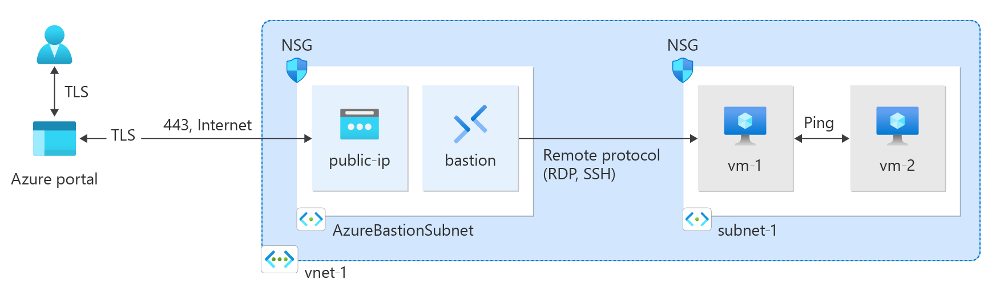

# How to create a VNET

## Goal of the Workshop

## Create a Virtual Network and Bastion Host
1. In the portal, search for and select **Virtual networks**.
2. Select **+Create**
3. Enter the following values:
    - **Name**: Enter a name for your virtual network.
    - **Region**: Select the region to create the virtual network in.
    - **Resource group**: Select the resource group to create the virtual network in.
4. Select **Next** to proceed to the security tab.
5. Select **Enable Bastion** in the Azure Bastion section of the Security tab.
> Azure Bastion is a fully managed PaaS service that provides secure and seamless RDP and SSH access to your virtual machines directly through the Azure Portal.
The pricing for Azure Bastion is based on the number of hours the service is enabled. For more information, see [Azure Bastion pricing](https://azure.microsoft.com/pricing/details/azure-bastion/).
6. Enter the following values:
    - **Name**: Enter a name for your Azure Bastion.
    - **Public IP address**: Select **Create new** and enter a name for your public IP address.
7. Select **Next** to proceed to the **IP Addresses** tab.
8. Enter the following values:
    - **Subnet template** : Default
    - **Starting address**: Enter the starting address for your subnet.
    - **Subnet name**: Enter a name for your subnet.
    - **Subnet address range**: Enter the subnet address range.
9. Select **Save** then ** Review + Create** and when the validation passes, select **Create**.

## Create virtual machines
In this part, we will create two Virtual Machines
1. In the portal, search for and select **Virtual machines**.
2. Select **+Create**
3. On the **Basic** Tab, enter or select the following informations:
    - **Subscription**: Select your subscription.
    - **Resource group**: Select the resource group you created earlier.
    - **Virtual machine name**: Enter a name for your virtual machine.
    - **Region**: Select the region to create the virtual machine in.
    - **Image**
    - **Size**
    - **Authentication type**: Select **Password**.
    - **Username**: Enter a username for your virtual machine.
    - **Password**: Enter a password for your virtual machine.
    - **Public inbound ports** : None
4. On the **Networking** tab, add the following informations:
    - **Virtual network**: Select the virtual network you created earlier.
    - **Subnet**: Select the subnet you created earlier.
    - **Public IP**: Select **None**.
    - **NIC network security group**: Select **Advanced**.
    - **Network security group**: Select **Create New**.
5. Leave the rest of the settings at defaukt and select **Review + Create**
6. For the second Virtual Machine, repeat the previous steps. The subnet and the NSG should be the same.
> Virtual machines in a virtual network with a bastion host don't need public IP addresses. Bastion provides the public IP, and the VMs use private IPs to communicate within the network. You can remove the public IPs from any VMs in bastion hosted virtual networks.

> Azure provides a default outbound access IP for VMs that either aren't assigned a public IP address or are in the back-end pool of an internal basic Azure load balancer. The default outbound access IP mechanism provides an outbound IP address that isn't configurable.
The default outbound access IP is disabled when one of the following events happens:
A public IP address is assigned to the VM.
The VM is placed in the back-end pool of a standard load balancer, with or without outbound rules.
An Azure Virtual Network NAT gateway resource is assigned to the subnet of the VM.
VMs that you create by using virtual machine scale sets in flexible orchestration mode don't have default outbound access.

## Connect to the Virtual Machines
1. In the portal, search for and select Virtual machines.
2. On the Virtual machines page, select vm-1.
3. In the Overview of vm-1, select Connect.
4. In the Connect to virtual machine page, select the Bastion tab.
5. Select Use Bastion.
6. Enter the username and password you created when you created the VM, and then select Connect.

## Communicate between VMs
1. At the bash prompt for
2. Close the Bastion connection to VM1.
3. Repeat the steps in Connect to a virtual machine to connect to VM2.
4. At the bash prompt for vm-2, enter ping -c 4 vm-1.