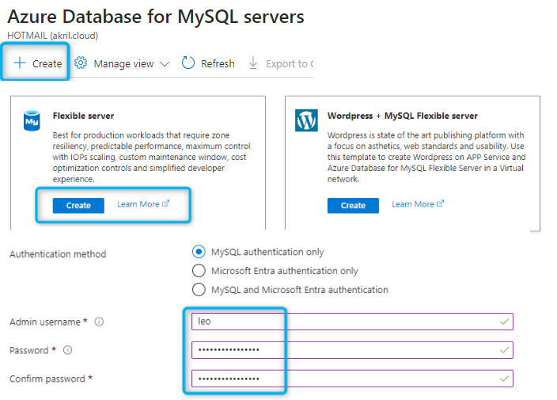

# Création de la web app dans Azure
Créer une web app dans Azure pour héberger votre site WordPress:

- Prendre PHP comme runtime Stack
- Ne pas cocher la case Create a Database
- Enable public access dans la section networking
- Choisir la taille de l'instance en fonction des besoins


# Création de la base de donnée MySQL dans Azure
Créer une base de donnée MySQL dans Azure pour héberger votre site WordPress:
- Choisir un Flexible server
- Choisir le même resource group et la même région que la Web App.
- Donner un nom à votre base de données
- Donner un admin username et un mot de passe (à conserver précieusement)
- Choisir la taille de l'instance en fonction des besoins



Pour l'instant garder les paramètres par défaut pour le reste.
Pour le networking :

- Allow Public access.
- Allow public access to Internet through the internet.
- Allow public access from any ressources.
- Ajouter votre Adresse IP dans Firewall rules


# Installation de WordPress
Pour installer WordPress, tout d'abord prendre un outil type MySql Workbench et se connecter avec :
- Cliquer sur le +
- Donner un nom à votre connexion
- Utilisez la méthode de connexion Standard (TCP/IP)
- Hostname :  Azure Server Name que vous trouverez dans la partie Overview de votre database dans Azure
- Port 3306 par défaut
- Username & Password sont les mots de identifiants que vous avez configuré lors de la création de votre Database.


Une fois connecté, créer une nouvelle base de données :
- Clic-droit dans le menu déroulant à gauche Create Schema
- Donner un nom à votre schéma puis Apply


# Installation de WordPress

- Cliquer sur SSH dans le menu déroulant de la WebApp -> Go
- Aller dans le répertoire root :
```bash
cd site/wwwroot
```

- Télécharger  le fichier tar.gz de WordPress directement dans l'Azure Web App.
https://akril.net/deployer-wordpress-avec-une-azure-web-app-et-mysql/amp/#:~:text=aux%20derni%C3%A8res%20versions-,ici,-.%C2%A0


- Retourner dans la commande SSH:
```bash
wget [link tar.gz]
tar -xzvf [your wordpress.tar.gz]
cd wordpress
mv * ../
```

- Retourner dans wwwroot

- En browsant la web app on doit avoir :


- Indiquer les informations de connexion à la base de données MySQL :

### pour corriger le site "moche" :
```bash
cd site/wwwroot
nano wp-config.php
```
 après la ligne : <?php et avant la ligne /** 
```php
@ini_set('session.cookie_httponly', true);
@ini_set('session.cookie_secure', true);
@ini_set('session.use_only_cookies', true);

$_SERVER["HTTPS"] = "on";
```
Rafraichir la page et on devrait obtenir ça : 


# Si besoin rajouter un custom domain dans la web app et faire les restrictions réseau nécéssairesÒ